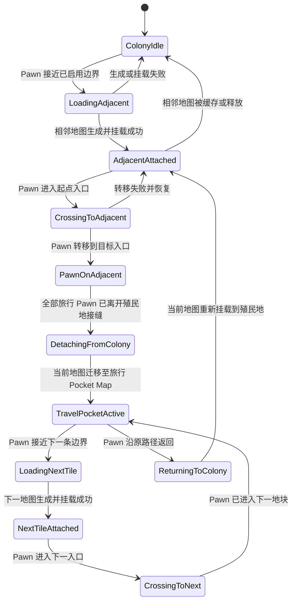

# 基于 Vehicle Map Framework 验证相邻地块无缝穿越

## 简述

实现一个最小技术原型：当殖民者接近殖民地地图的一侧边界时，加载该方向对应的相邻世界地块，将其作为 Vehicle Map 叠加在当前地图边缘，并允许殖民者通过边界入口转移到相邻地图。

原型用于验证 Vehicle Map Framework 是否能够支持以下核心能力：

1. 在当前地图边界之外绘制并操作一张相邻地图。
2. 将殖民者从当前地图转移到相邻地图，并保持位置、选中状态和玩家控制连续。
3. 将承载相邻地块的 Vehicle Map 从殖民地地图迁移到旅行 Pocket Map。
4. 在旅行 Pocket Map 中同时挂载当前地块和下一个相邻地块。

原型完成后，应能够据此决定正式实现继续依赖 Vehicle Map Framework，还是开发独立的地图叠加后端。

本 Story 不负责实现连续世界地形生成、跨地图自动工作、跨边界建筑和完整的世界旅行玩法。这些能力应在技术原型通过后分别设计。

## 前置条件

- 当前 RimWorld 版本能够正常加载 Vehicle Framework 和 Vehicle Map Framework。
- 开发环境能够引用以下程序集：
  - `Vehicles.dll`
  - `VehicleMapFramework.dll`
  - `0Harmony.dll`
- 已确认测试地图所在世界地块至少存在一个可进入的相邻地块。
- 原型中的测试 Pawn 可以被征召并接受移动命令。
- 测试存档不用于长期游玩，允许因原型缺陷损坏。

## 背景

RimWorld 的世界地块和局部地图彼此独立。殖民者通常需要离开当前地图、组成远行队，再通过世界地图移动到其他地块。

本方案将相邻世界地块表示为独立的局部地图，并通过 Vehicle Map Framework 将其叠加到当前场景。玩家看到的空间关系如下：

```text
当前地图 A                 相邻地图 B
┌──────────────┐        ┌──────────────┐
│              │        │              │
│             出口 ─── 入口             │
│              │        │              │
└──────────────┘        └──────────────┘
```

地图之间不共享房间、电网、仓储区或工作系统。殖民者到达接缝入口后，由控制器显式结束当前移动，转移到目标地图的对应入口，再在目标地图中继续移动。

Vehicle Map Framework 作为原型的地图叠加后端。业务层使用独立的数据模型记录世界地块、接缝和活动窗口，使后续能够替换叠加实现，而不需要重写旅行状态和地图生成逻辑。

## 对象与职责

### `WorldTileInstance`

表示一个已生成或准备生成的世界地块局部地图。

| 字段 | 含义 |
|---|---|
| `representedWorldTile` | 此实例实际代表的世界地块 ID |
| `map` | 已生成的 RimWorld `Map`；尚未生成时为空 |
| `state` | 当前生命周期状态 |
| `anchor` | 当前用于承载地图的 VMF 锚点 |
| `lastHostMap` | 最近一次承载该地块的基底地图 |
| `generationSeed` | 用于稳定重建该地块的生成种子 |

`representedWorldTile` 是地块身份的唯一依据。不得使用 VMF 内部地图的 `Map.Tile` 推断该实例代表的世界地块，因为 VMF 可能将内部地图的 Tile 同步为宿主地图的 Tile。

建议状态：

| 状态 | 含义 |
|---|---|
| `Unloaded` | 尚未生成或已经释放 |
| `Generating` | 正在生成局部地图 |
| `AttachedToColony` | 作为殖民地相邻地图显示 |
| `AttachedToTravelPocket` | 挂载在旅行 Pocket Map 中 |
| `Cached` | 保留地图实例，但当前不显示 |
| `Removing` | 正在安全释放地图及锚点 |

### `SeamConnection`

表示两个相邻世界地块之间的一条可穿越接缝。

| 字段 | 含义 |
|---|---|
| `sourceTile` | 起点世界地块 |
| `targetTile` | 目标世界地块 |
| `sourceDirection` | 接缝位于起点地图的方向 |
| `targetDirection` | 接缝位于目标地图的方向 |
| `sourcePortalCells` | 起点地图上的入口格集合 |
| `targetPortalCells` | 目标地图上的入口格集合 |
| `coordinateMapping` | 两侧入口位置的映射规则 |

每条接缝必须可以双向使用。由 A 进入 B 时使用的入口映射，应与由 B 返回 A 时保持对称。

### `TerrainMapAnchor`

表示 VMF 中承载地块地图的透明锚点。

第一版可以继承 `VehiclePawnWithMap`，并关闭与旅行地块无关的车辆行为。

锚点应满足以下约束：

- 不显示车辆贴图。
- 不显示车辆 Gizmo。
- 不允许玩家驾驶或移动。
- 不参与载荷、燃料和车辆升级系统。
- 不作为可攻击目标。
- 不允许旋转。
- 使用固定坐标变换对齐地图接缝。
- 保存并恢复其对应的 `WorldTileInstance`。
- 地图移交宿主时保留原有 Map 实例。

`TerrainMapAnchor` 是 VMF 适配层对象，不得作为世界地块、旅行状态或接缝关系的业务数据源。

### `ActiveTileWindow`

管理当前同时保持活动的地块。

原型至少支持以下槽位：

| 槽位 | 作用 |
|---|---|
| `originTile` | 殖民地或旅行开始时的当前地块 |
| `currentTile` | 旅行 Pawn 当前所在的地块 |
| `nextTile` | 当前移动方向对应的相邻地块 |
| `previousTile` | 为立即折返而暂时保留的上一地块 |

第一版可以只同时保留两张地图，即 `currentTile` 和 `nextTile`。完成 Pocket Map 迁移验证时，再增加 `previousTile`。

## 正常流程



## 步骤

### 1. 建立 VMF 适配层

新增一个隔离 Vehicle Map Framework 类型的后端接口。业务控制器只通过该接口创建、挂载、移动和移除地块地图。

建议契约：

```csharp
public interface ITileOverlayBackend
{
    TerrainMapHandle AttachToMap(
        WorldTileInstance tile,
        Map hostMap,
        TileOverlayTransform transform);

    void MoveToHost(
        TerrainMapHandle handle,
        Map targetHost,
        TileOverlayTransform transform);

    void Detach(TerrainMapHandle handle);

    bool TryScreenToTileCell(
        TerrainMapHandle handle,
        Vector3 worldPosition,
        out IntVec3 tileCell);
}
```

第一版实现命名为：

```csharp
VmfTileOverlayBackend
```

除适配层外，不得在旅行控制器、接缝控制器和世界地块数据中引用 `VehiclePawnWithMap`、`MapParent_Vehicle` 或其他 VMF 具体类型。

### 2. 创建测试地块锚点

实现 `TerrainMapAnchor`，使用最小占地和透明图形。

锚点生成内部地图时，应使用 `WorldTileInstance.representedWorldTile` 对应的生态区和世界数据。生成结果必须记录回原有 `WorldTileInstance`，避免每次挂载都重新生成地图。

原型允许先生成矩形地图。六边形遮罩不属于此步骤的通过条件。

### 3. 将相邻地图放置在当前地图边界之外

在测试殖民地地图的一侧创建地块锚点，使相邻地图的入口边与殖民地地图的对应出口边对齐。

首个原型固定使用东侧接缝：

| 当前地图 | 相邻地图 |
|---|---|
| 东侧出口 | 西侧入口 |
| 出口格序号从北向南增加 | 入口格序号从北向南增加 |
| 当前地图最后一个可通行列 | 相邻地图第一个可通行列 |

相邻地图的大部分区域应位于当前地图的逻辑边界之外，以验证 VMF 对边界外地图的支持情况。

完成挂载后检查：

- 相邻地图地形能够正常绘制。
- 摄像机可以移动到相邻地图。
- 鼠标悬停能够识别相邻地图格子。
- 可以选中相邻地图中的 Pawn 和 Thing。
- 可以在相邻地图中下达本地图移动命令。
- 存档并读取后，地图位置与内容保持一致。

### 4. 建立接缝入口

在当前地图和相邻地图上分别创建一组入口格。

第一版使用一一对应映射：

```text
sourcePortalCells[index] -> targetPortalCells[index]
```

当两侧入口长度不同，应按归一化位置映射：

```csharp
targetIndex = RoundToInt(
    sourceIndex /
    Max(1f, sourceCount - 1f) *
    Max(0f, targetCount - 1f));
```

入口格必须满足：

- 可站立。
- 不包含建筑。
- 不处于深水或其他禁止进入地形。
- 转移后至少存在一个可到达的相邻格。
- 不作为普通地图撤离格处理。

### 5. 实现 Pawn 显式转移

Pawn 进入起点入口格后，执行以下流程：

1. 暂停或结束当前移动 Job。
2. 记录 Pawn 当前选中状态。
3. 记录 Pawn 在入口格序列中的位置。
4. 从起点地图安全 `DeSpawn`。
5. 将 Pawn 生成到目标地图的映射入口。
6. 恢复选中状态。
7. 根据原移动方向，在目标地图入口内侧设置一个短距离移动目标。
8. 为 Pawn 下达新的本地图移动 Job。

转移期间不得让原 Job 继续持有另一张地图中的 `LocalTargetInfo`。

Pawn 携带的装备、服装、库存和当前健康状态必须随 Pawn 一起保留。第一版不要求保留原 Job 的完整执行进度。

### 6. 实现转移失败恢复

以下任一条件成立时，不执行地图转移：

- 目标地图尚未完成生成。
- 目标入口不可站立。
- Pawn 正处于不可中断状态。
- Pawn 正被搬运。
- Pawn 是某个容器中的内容物。
- 接缝正在关闭或迁移。
- 目标地图正在销毁。

如果 Pawn 已经从起点地图移除，但无法生成到目标地图，应优先尝试：

1. 目标入口附近的可站立格。
2. 起点地图原入口格。
3. 起点入口附近的可站立格。

所有恢复路径失败时，记录错误并暂停游戏，不得静默删除 Pawn。

### 7. 将相邻地图迁移到旅行 Pocket Map

当所有被标记为本次旅行成员的 Pawn 均已进入相邻地图，并且接缝周围没有未完成转移时：

1. 创建或取得旅行 Pocket Map。
2. 禁止殖民地与相邻地图之间的新转移。
3. 移除殖民地侧接缝入口。
4. 将相邻地块锚点迁移到旅行 Pocket Map。
5. 保持 `WorldTileInstance.map` 指向原 Map 实例。
6. 重新计算锚点在旅行 Pocket Map 中的位置。
7. 恢复旅行地图的选择、摄像机和移动操作。
8. 释放殖民地对该锚点的引用。

迁移过程中不得销毁并重新生成相邻地图。

### 8. 在旅行 Pocket Map 中挂载下一地块

旅行 Pawn 接近当前地块的目标边界时：

1. 根据 `representedWorldTile` 和前进方向查询相邻世界地块。
2. 创建对应的 `WorldTileInstance`。
3. 生成或读取下一地块地图。
4. 将当前地图和下一地图作为同一个 Pocket Map 下的兄弟锚点。
5. 对齐双方接缝。
6. 复用 Pawn 显式转移流程完成穿越。
7. Pawn 全部进入下一地块后，将上一地块标记为 `previousTile` 或 `Cached`。

下一地图不得作为当前地块 Vehicle Map 的嵌套 Vehicle Map。

## 预期结果

原型完成后，应满足以下验收条件。

### 地图显示

- 相邻地图至少 80% 的区域位于宿主地图逻辑边界之外。
- 玩家可以正常查看相邻地图的地形、Pawn 和 Thing。
- 相邻地图中的对象可以被单击选择。
- 相邻地图中的格子能够接收本地图移动命令。
- 摄像机跨越接缝时不会被强制拉回宿主地图中心。

### Pawn 转移

- 一个征召 Pawn 可以从殖民地地图进入相邻地图。
- Pawn 可以沿同一接缝返回殖民地。
- Pawn 的健康、装备、服装和库存保持不变。
- Pawn 转移后不会同时存在于两张地图。
- Pawn 转移失败时不会丢失或被销毁。
- 连续往返十次后不产生重复 Pawn、残留选择对象或无效地图引用。

### 地图迁移

- 相邻地图能够从殖民地宿主迁移到旅行 Pocket Map。
- 迁移前后的 `Map.uniqueID` 保持不变。
- 迁移前放置在地图中的测试物品保持原位置和状态。
- 保存并读取后，地图仍挂载在正确宿主中。
- 在旅行 Pocket Map 中可以同时显示当前地块和下一地块。

### 架构边界

- 世界地块身份来自 `representedWorldTile`。
- 业务层不读取 VMF 内部字段判断旅行状态。
- VMF 类型只出现在适配层和 `TerrainMapAnchor` 实现中。
- 替换 `ITileOverlayBackend` 时，不需要修改接缝映射和 Pawn 转移规则。

## 示例

### 从殖民地向东进入相邻地块

初始状态：

```text
殖民地世界地块：1024
东侧相邻世界地块：1025
Pawn 所在地图：1024 对应地图
```

加载后：

```text
Host Map
├── Colony Map，representedWorldTile = 1024
└── TerrainMapAnchor
    └── Adjacent Map，representedWorldTile = 1025
```

Pawn 到达殖民地东侧入口第 12 格：

```text
A.eastPortal[12]
```

接缝控制器计算：

```text
B.westPortal[12]
```

随后执行：

```text
DeSpawn Pawn from A
Spawn Pawn at B.westPortal[12]
Continue local movement inside B
```

全部旅行 Pawn 进入 B 后：

```text
Colony Map A
└── 不再挂载 B

Travel Pocket Map
└── TerrainMapAnchor B
    └── Adjacent Map B
```

Pawn 继续向东时：

```text
Travel Pocket Map
├── TerrainMapAnchor B
│   └── Current Map B
└── TerrainMapAnchor C
    └── Next Map C
```

## 已知限制

原型采用显式 Pawn 转移，仅验证玩家控制下的连续穿越。

以下能力暂不属于正常流程：

- 建筑跨越接缝。
- 房间跨越接缝。
- 电网、管网和仓储区跨越接缝。
- 自动工作跨地图寻找目标。
- 搬运任务跨越接缝。
- 射弹、爆炸、火灾和温度跨越接缝。
- 敌人自主追击到另一张地图。
- Vehicle Map 嵌套 Vehicle Map。
- 相邻地块边缘地形连续生成。
- 六边形地图遮罩。
- 任意方向同时加载多个相邻地块。

这些限制用于控制原型范围。确认 VMF 的边界外绘制、选择和地图迁移可用后，再分别建立后续 Story。

## 后续要求

根据原型结果选择后续路线。

| 验证结果 | 后续处理 |
|---|---|
| 边界外绘制、选择和 Pawn 转移均正常 | 继续将 VMF 作为正式依赖 |
| 仅少数格子查询或 GUI 路径失败 | 在适配层增加补丁，并评估向 VMF 提交扩展接口 |
| 地图迁移需要访问 VMF 私有生命周期 | 提交最小上游修改，增加可覆写的地图创建与迁移接口 |
| 边界外地图无法稳定交互 | 停止扩展 VMF，设计独立的 Map Overlay 后端 |
| 需要大范围修改 VMF 核心补丁 | 不建立长期 fork，改为抽取需求并自行实现精简后端 |

原型通过后，应分别建立以下文档或 Story：

1. 六边形局部地图与六方向接缝。
2. 相邻世界地块连续地形生成。
3. 旅行成员、队伍状态和世界时间推进。
4. 地块缓存、保存和释放策略。
5. 敌人、动物和车辆的跨地块转移。
6. 接缝附近战斗与撤退规则。
7. VMF 依赖、兼容范围和故障诊断说明。

修改上述工作流时，应同步更新相关 README、开发文档、设置说明和本地化文本。代码中的字段名、状态名和行为发生变化时，以实际实现为准，并同步修正文档中的 Mermaid 图、表格和示例。