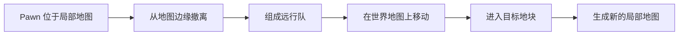
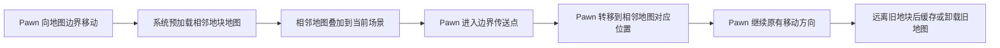
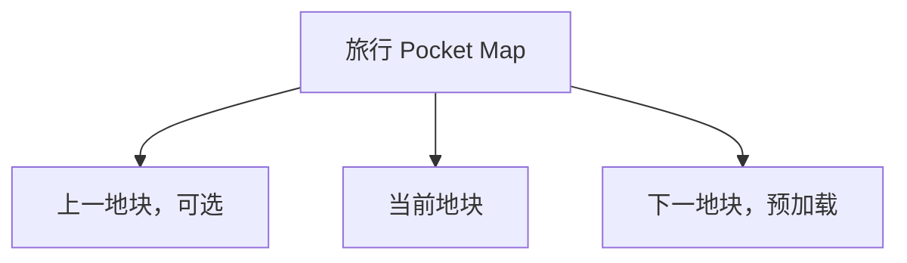

# 无缝世界地块探索

## 简述

RimWorld 的世界由大量相邻地块组成，但每个地块对应的局部地图彼此独立。Pawn 离开当前地图后，需要进入世界地图上的远行队状态，再等待目标地块生成新的局部地图。

这种结构可以表现长距离战略旅行，却无法表现 Pawn 从殖民地周边自然走入荒野的过程。玩家每跨越一个世界地块，都需要经历地图边缘撤离、世界地图移动和新地图加载，旅行体验因此被切割成多个互不连续的场景。

本 Story 计划实现一套无缝世界地块系统，使相邻世界地块对应的局部地图能够在视觉和操作上连续连接。Pawn 走到当前地图边界后，可以直接进入相邻地块的地图，而不必先组成远行队或经过显式切换界面。

本文档作为该功能的长期设计记录。开发过程中应逐步补充调研结论、技术验证结果、实现约束和后续计划。

## 背景

RimWorld 同时存在两套不同尺度的地图：

- 世界地图使用近似六边形的地块表示地理空间。
- 局部地图使用矩形格子表示殖民地、战场和事件地点。

每张局部地图只属于一个世界地块。相邻世界地块之间虽然在世界地图上直接相连，但对应的局部地图没有连续坐标关系，也不会同时显示。

当前旅行流程通常为：



这套流程适合跨越较远距离，但会产生明显的旅行割裂：

- Pawn 无法从基地门口直接走进相邻荒野。
- 玩家不能沿道路、河流或海岸连续探索。
- 追击、撤退和短距离采集会被世界地图流程中断。
- 相邻地块的地形没有空间连续性。
- 局部地图无法直观体现其在世界地图中的相邻关系。

本系统首先解决局部地图之间的连续穿越问题，不以扩大单张殖民地地图为目标。

## 理想结果

每个普通世界地块对应一张经过六边形裁切的局部地图。六条边分别对应世界地图上的六个相邻地块。

相邻局部地图满足以下关系：

- 双方边界的位置和长度可以相互映射。
- 山脉、河流、道路、海岸和主要地形在接缝处自然延续。
- Pawn 可以直接从一张地图的边界走入相邻地图。
- 相邻地图在 Pawn 到达边界前完成预加载。
- 玩家跨越接缝时不会看到显式加载界面。
- 当前未使用的远端地图可以卸载或转入低成本保存状态。

局部地图在底层仍然可以保持矩形数据结构。六边形以外的区域由不可通行且不可见的地形填充，从而使可活动区域与世界地图地块的形状对应。

Pawn 穿越地块的正常流程为：



第一阶段不要求建筑、房间、电网或物流跨越地块边界。每张地图仍然是独立的 RimWorld 地图，只需要让 Pawn 的移动和玩家的观察保持连续。

## 已完成调研

目前主要调研对象为 Vehicle Map Framework，以下简称 VMF。

VMF 可以在一张真实地图上叠加额外的 Pocket Map。Vehicle Framework 中的车辆可以拥有自己的内部地图，玩家能够看到、选择和操作内部地图中的 Pawn、建筑与物品。

VMF 已经处理了多张地图同时显示时的大量基础问题，包括：

- Pocket Map 的创建、保存和加载。
- 子地图与宿主地图之间的坐标转换。
- 子地图的绘制、选取和鼠标交互。
- Pawn 在地图之间的转移。
- 部分跨地图移动、工作和战斗行为。
- 与 RimWorld 原版系统及部分 Mod 的兼容。

VMF 中还存在类似车辆楼梯的跨地图入口。Pawn 走过入口后，可以从宿主地图进入车辆内部地图。该机制与本系统需要的地块边界入口高度相似。

初步判断是：VMF 已经解决了“如何在同一场景中显示和操作多张 RimWorld 地图”这一最昂贵的问题，因此应优先验证能否将其作为依赖使用。

当前仍需验证的关键问题包括：

| 问题 | 原因 |
|---|---|
| VMF 是否支持将大部分区域放在宿主地图边界之外 | 相邻地块需要显示在当前地图外侧，而车辆地图通常位于宿主地图范围内 |
| 非车辆用途的静态地图锚点是否可行 | 地块地图没有车辆移动、燃料、载荷等需求 |
| Pocket Map 能否在不同宿主之间迁移 | Pawn 离开基地后，当前地块需要转入独立的旅行空间 |
| 多张同级 Pocket Map 能否稳定拼接 | 旅行时需要同时保留当前地块和下一个地块 |
| VMF 的地图入口能否保持玩家移动连续 | Pawn 转移后需要继续原来的移动方向 |
| 地图保存和重新载入后能否恢复接缝关系 | 该系统必须支持正常存档 |

根据验证结果，后续可以选择：

1. 直接依赖 VMF；
2. 为 VMF 增加少量通用扩展接口；
3. 保留整体设计，自行实现精简的地图叠加层。

现阶段不计划直接 fork VMF。长期 fork 会同时承担 RimWorld、Vehicle Framework 和 VMF 更新带来的维护成本。

## 预期技术路线

### 地块地图

每个已访问的世界地块可以生成一张独立的 RimWorld 局部地图。

局部地图底层仍然是矩形。系统根据世界地块形状生成六边形可活动区域，并在六边形外部放置不可通行透明地形。

这种方式可以继续使用 RimWorld 现有的：

- 格子系统；
- 寻路系统；
- 地图生成流程；
- 建筑和 Thing 管理；
- 存档机制。

六条边分别记录其对应的世界邻居和边界入口。

世界地图中少量非六边形地块需要后续单独处理。初期原型可以限制在具有六个邻居的普通地块上。

### 相邻地图叠加

当 Pawn 接近地图边界时，系统根据该边对应的世界邻居确定目标地块。

目标地块地图应在 Pawn 到达边界前完成生成，并通过 VMF 或等价机制叠加到当前场景中。

地图之间保持独立，只在接缝位置建立对应关系：

```text
当前地图出口格 N
        ↓
相邻地图入口格 N
```

玩家可以提前看到边界另一侧的地形、Pawn 和物品，从而避免进入边界后再显示加载界面。

### 跨地图入口

在每条可用边界上放置类似 VMF 车辆楼梯的跨地图传送点。

Pawn 走过传送点时：

1. 记录 Pawn 在当前边界上的相对位置。
2. 将 Pawn 从当前地图移除。
3. 在相邻地图对应的边界位置生成 Pawn。
4. 保留装备、服装、库存、健康和玩家选择状态。
5. 在相邻地图中继续原有移动方向。

这一过程在实现上属于地图转移，但在玩家看来应表现为 Pawn 连续走过地图接缝。

第一阶段只保证玩家直接命令 Pawn 穿越接缝。自动工作、搬运和远距离寻路不需要跨地图执行。

### 旅行地图管理

Pawn 从基地进入第一个相邻地块时，该地块可以暂时叠加在基地地图上。

当 Pawn 继续远离基地时，当前地块不再适合继续依附于基地地图。系统应创建一个独立的旅行 Pocket Map，作为旅行过程中各地块地图的宿主。

旅行状态下通常只保留：

- Pawn 当前所在的地块；
- 前进方向上的下一个地块；
- 必要时保留刚刚离开的上一个地块。



Pawn 进入下一地块并远离接缝后，上一地块可以：

- 暂时缓存，以支持立即折返；
- 保存后卸载；
- 根据具体地点类型重新生成。

地块地图之间应作为同一宿主下的同级地图存在，避免形成多层 Pocket Map 嵌套。

### 连续地形生成

默认的 RimWorld 地图生成器会独立生成每个地块，因此相邻地图的接缝通常不会自然对应。

本系统需要为每一对相邻世界地块建立共享的边界生成条件。

接缝两侧至少需要共享：

- 高度与山体轮廓；
- 水域和海岸线；
- 河流入口；
- 道路入口；
- 土壤和主要地形类型；
- 植被密度的整体趋势。

相邻地块应根据相同的边界种子生成接缝数据。例如 A 与 B 之间的接缝，无论先生成哪一侧，都应得到相同的山体、道路和河流位置。

地图内部仍然可以使用原版或其他地图生成 Mod 的逻辑。接近边界时，将内部生成结果逐渐混合到共享边界条件，使过渡保持自然。

第一阶段只需要验证简单地形能够正确对齐。完整兼容各类地图生成 Mod 属于后续工作。

## 功能边界

该系统的核心职责是提供地块之间的连续旅行。

计划支持：

- Pawn 从当前地块直接进入相邻地块。
- 相邻地图的提前加载和场景叠加。
- 地块之间的位置映射。
- 六边形地图裁切。
- 相邻地形的连续生成。
- 当前、上一和下一地块的生命周期管理。
- 地块之间的往返和连续探索。

初期不要求支持：

- 跨地块建造建筑。
- 跨地块房间。
- 跨地块电网、管网或仓储区。
- 自动工作跨地图寻找目标。
- 普通搬运任务跨地图执行。
- 射弹、爆炸、火灾和温度跨越接缝。
- 敌人无限距离追击。
- 将多个地块组合成一座超大型殖民地。

这些能力会显著扩大跨地图兼容范围，并不是实现连续旅行所必需的条件。

## 当前阶段计划

当前阶段的目标是建立一个独立 Markdown 文件，作为该功能的长期设计与调研记录。

该文件应随开发逐步补充，不要求一次确定完整架构。

当前阶段按以下顺序推进。

### 1. 整理 VMF 调研结果

记录 VMF 中与本系统直接相关的实现：

- Pocket Map 的创建和生命周期。
- 地图坐标转换。
- 地图绘制与选择。
- 车辆楼梯或其他跨地图入口。
- Pawn 转移流程。
- 地图锚点与车辆逻辑之间的耦合。
- 地图位于宿主边界之外时可能受到影响的代码。
- 存档和地图宿主迁移机制。

调研内容应包含对应源码位置和实际行为。文档描述与实现不一致时，以当前实现为准。

#### 1.1 关键结论（先读）

VMF 的 Pocket Map 机制建立在 **RimWorld 原生 `PocketMapParent` 类**之上，并非 VMF 独有。RimWorld 通过 `Find.World.pocketMaps` 列表原生支持"宿主地图 + 口袋地图"结构。这对本系统是重大利好：宿主迁移（把地块地图从一个宿主换到另一个宿主）在底层是受支持的。

但 VMF 的**渲染与车辆强耦合**：口袋地图要么把行星视图渲染进 RenderTexture 再画成网格（`Patch_Map_MapUpdate`），要么在车辆位置直接绘制 SectionLayer。这套设计面向"跟随移动车辆的小尺寸地图"，**不直接适用于静态、大尺寸、位于宿主边界之外的世界地块地图**。因此本系统大概率需要：复用 `PocketMapParent`/`sourceMap` 机制 + 自行实现地图叠加层渲染，而不是直接依赖 VMF 的渲染管线。

#### 1.2 Pocket Map 的创建和生命周期

- 基类：`references/RimWorldDecompiled/RimWorld.Planet/PocketMapParent.cs`。字段 `Map sourceMap`（宿主地图）与 `MapGeneratorDef mapGenerator`，`ExposeData` 会保存两者。
- 创建：`references/VehicleMapFramework/Source/VehicleMapFramework/Things/VehiclePawnWithMap.cs` 的 `GenerateVehicleMap(Map sourceMap)`（约 548 行）：
  1. 用 `WorldObjectMaker.MakeWorldObject(VMF_DefOf.VMF_VehicleMap)` 创建 `MapParent_Vehicle`（继承 `PocketMapParent`）。
  2. 设置 `mapParent.sourceMap = sourceMap`。
  3. 调用 `MapGenerator.GenerateMap(mapSize, mapParent, mapParent.MapGeneratorDef, mapParent.ExtraGenStepDefs, isPocketMap: true)`。
  4. 加入 `Find.World.pocketMaps`。
  5. 地图尺寸为 `props.size + 2`（每轴各 +2）。
- 生命周期：地图在首次访问 `VehicleMap` 时**惰性生成**；`RemoveVehicleMap()`（约 628 行）将 `pocketMapParent.sourceMap = null`、从 `Find.World.pocketMaps` 移除、调用 `Current.Game.DeinitAndRemoveMap(interiorMap, false)` 卸载。
- 对无缝地块的意义：`sourceMap` 字段就是"宿主"指针。把地块地图的 `sourceMap` 从基地地图改为旅行 Pocket Map，即可实现宿主迁移（见 1.8）。

#### 1.3 地图坐标转换

- `references/VehicleMapFramework/Source/VehicleMapFramework/Utilities/VehicleMapUtility.cs`：
  - `ToBaseMapCoord(vehicle)`：`(original - pivot).RotatedBy(vehicle.FullAngle) + vehiclePos + OffsetFor(vehicle)`，`pivot` 为地图中心。
  - `ToVehicleMapCoord(vehicle)`：逆运算。
  - `OffsetFor(vehicle, rot)`：从 `VehicleMapProps`（offsetNorth/South/East/West 等）取偏移。
  - `TryGetVehicleMap(IntVec3 c, Map map, out vehicle)`：用 `VehicleMapGrid.VehicleAt(c)` 反查。
- 坐标转换依赖车辆的位置、朝向和偏移。对静态地块地图，若采用"地图相对宿主固定偏移"的模型，可简化掉旋转项，只保留平移。

#### 1.4 地图绘制与选择

- 绘制（关键差异点）：`references/VehicleMapFramework/Source/VehicleMapFramework/VMF_HarmonyPatches/Patches_Map.cs` 的 `Patch_Map_MapUpdate`（约 228 行）：
  - 当 `drawPlanet` 开启且当前聚焦车辆地图时，把**行星视图渲染进 RenderTexture**（`TextureSize=2048`），再作为网格画在宿主地图上（`MeshSize=200`）。
  - 备选：`VehiclePawnWithMap.DrawVehicleMapMesh()` 直接在车辆位置绘制 SectionLayer。
  - 该渲染管线面向"跟随车辆的小地图"，且依赖 `Find.WorldCamera`/行星视图，**不适合大尺寸静态地块地图**。
- 选择：`Patches_Selector.cs` 的 `Patch_Selector_SelectableObjectsUnderMouse` 用 `TryGetVehicleMap` + `ToVehicleMapCoord` 把鼠标位置映射到口袋地图并选中对象。`UI/Command_FocusVehicleMap.cs` 的 `FocusedVehicle`/`FocusLockedVehicle` 跟踪聚焦状态（`FocusVehicle` 是 `IDisposable`，用于作用域聚焦）。
- 对无缝地块的意义：选择逻辑（坐标反查）可复用；渲染逻辑需自行实现（把相邻地块地图作为叠加层画在宿主地图上）。

#### 1.5 跨地图入口（车辆楼梯）

- `references/VehicleMapFramework/Source/VehicleMapFramework/Comps/CompVehicleEnterSpot.cs`：`ThingComp`，标记入口点。`Available` 检查对侧格子是否越界/可扩展；`EnterVehiclePosition` 委托给 `CrossMapReachabilityUtility`。
- `references/VehicleMapFramework/Source/VehicleMapFramework/Utilities/CrossMapReachabilityUtility.cs`：`EnterVehiclePosition` 计算 Pawn 进入前站在宿主地图上的位置；`CanReach` 处理跨地图寻路。
- 对无缝地块的意义：入口机制（宿主地图上的一个"进入点" + 对侧口袋地图位置）可复用为地块接缝入口。

#### 1.6 Pawn 转移流程

- `references/VehicleMapFramework/Source/VehicleMapFramework/Jobs/ToilsAcrossMaps.cs` 的 `GotoTargetMap`：走到出口点 → 开门 → 地图过渡动画（用 `driver.drawOffset` 让 Pawn 视觉上连续移动）→ `DeSpawnWithoutJobClear()` + `GenSpawn.Spawn(pawn, pos, map, rot)` 把 Pawn 从一张地图转移到另一张。
- `references/VehicleMapFramework/Source/VehicleMapFramework/Jobs/JobDrivers/JobDriverAcrossMaps.cs`：抽象 JobDriver，含 `exitSpotA/B`、`enterSpotA/B`、`spotsQueue`，处理跨地图点的存档/读档。
- 对无缝地块的意义：`DeSpawn + GenSpawn` 的转移方式 + `drawOffset` 视觉过渡，正是"Pawn 直接走进相邻地图"所需的核心机制，可整体复用。

#### 1.7 地图锚点与车辆逻辑之间的耦合

- `MapParent_Vehicle`（`VehicleMap/MapParent_Vehicle.cs`）持有 `VehiclePawnWithMap vehicle` 字段。
- 口袋地图的位置由车辆位置/朝向/偏移推导（`cachedDrawPos`/`cachedExactPos`、`VehicleMapProps`）。
- `VehicleMapGrid`（`MapComponents/VehicleMapGrid.cs`）：`MapComponent`，用 `vehicleGrid` 数组把宿主地图格子映射到车辆。
- `VehiclePawnWithMapCache`（`MapComponents/VehiclePawnWithMapCache.cs`）：缓存地图上的车辆，`FinalizeInit` 调用 `VehicleMapParentsComponent.SetCachedVehicle`。
- `VehicleSectionLayerManager`（`MapComponents/VehicleSectionLayerManager.cs`）：管理车辆地图 SectionLayer，带旋转缓存（每个朝向层 4 个旋转）。
- 对无缝地块的意义：这些组件把地图生命周期绑定到"车辆"这一实体。若地块地图不依附车辆，需要把"锚点"抽象为静态宿主（如基地地图或旅行 Pocket Map），去掉旋转/偏移耦合。

#### 1.8 存档和地图宿主迁移机制

- `PocketMapParent.ExposeData` 保存 `sourceMap` 与 `mapGenerator`。
- `VehiclePawnWithMap.ExposeData`（约 1397 行）保存 `interiorMap`、`allowEnter`、`allowExit`。
- 读档时 `SpawnSetup`（约 653 行）重新关联 `interiorMap.PocketMapParent.sourceMap = map`。
- `WorldComponents/VehicleMapParentsComponent.cs`：`WorldComponent`，按地图 uniqueID 缓存 `MapParent_Vehicle`。
- 宿主迁移：`sourceMap` 是普通字段，可在运行时改写。把地块地图的 `sourceMap` 从基地地图改为旅行 Pocket Map（或反之），即可迁移宿主；配合 `Find.World.pocketMaps` 的增删即可完成。
- 对无缝地块的意义：宿主迁移在底层受原生支持，是本系统"基地 → 旅行 Pocket Map → 下一地块"流程的关键依据。

#### 1.9 对无缝地块系统的架构评估

- **可复用**：`PocketMapParent`/`sourceMap` 宿主机制、`Find.World.pocketMaps`、跨地图 Pawn 转移（`ToilsAcrossMaps`/`JobDriverAcrossMaps`）、入口机制（`CompVehicleEnterSpot`/`CrossMapReachabilityUtility`）、坐标反查选择逻辑。
- **需自行实现**：地图叠加层渲染（VMF 的 RenderTexture/行星视图方案面向车辆小地图，不适合大尺寸静态地块地图）、把"锚点"从车辆抽象为静态宿主、六边形裁切与连续地形。
- **结论**：倾向于"复用 PocketMapParent 机制 + 自行实现叠加层渲染"，而非直接依赖 VMF 渲染管线。是否把 VMF 作为正式依赖，由第 2 步最小技术原型验证后决定。

### 2. 建立最小技术原型

原型使用两张矩形地图，不实现六边形裁切和连续地形。

验证流程：

1. 在殖民地地图一侧生成相邻地块地图。
2. 将相邻地图的大部分区域放置在殖民地地图边界之外。
3. 确认地图可以绘制、选取和接收移动命令。
4. 在两张地图边界放置跨地图入口。
5. 让一个征召 Pawn 往返穿越接缝。
6. 保存并重新加载游戏。
7. 验证地图、Pawn 和接缝关系能够恢复。

该原型用于决定 VMF 是否适合作为正式依赖。

### 3. 验证旅行 Pocket Map

基础穿越成功后，验证：

1. Pawn 从基地进入相邻地块。
2. 当前地块地图从基地宿主迁移到旅行 Pocket Map。
3. 在旅行 Pocket Map 中加载第二个相邻地块。
4. Pawn 从当前地块进入下一地块。
5. 旧地块被缓存或卸载。
6. Pawn 可以沿原路返回基地。

### 4. 实现六边形裁切

在矩形地图中生成六边形可活动区域。

验证：

- 六条边可以分别映射到六个世界邻居。
- 边界入口长度和位置可以稳定计算。
- Pawn 无法进入六边形外部区域。
- 六边形外部区域不会产生建筑、植物、Pawn 或事件目标。
- 地图接缝可以准确对齐。

### 5. 实现连续地形原型

首先选择一种简单地形，例如平原或山地。

验证相邻地图可以共享：

- 边界高度；
- 一条道路；
- 一条河流或水域；
- 基础地形分布。

连续地形验证通过后，再评估原版地图生成器和地图生成 Mod 的兼容方式。

## 当前阶段预期结果

当前阶段结束时，文档应能够回答以下问题：

- VMF 能否显示并操作位于宿主地图边界之外的 Pocket Map？
- VMF 是否允许地块地图在不同宿主之间迁移？
- 是否可以通过类似车辆楼梯的入口实现稳定的 Pawn 转移？
- 该方案需要修改 VMF、为 VMF 编写补丁，还是自行实现地图叠加层？
- 两张局部地图连续穿越的最小实现需要修改哪些 RimWorld 系统？
- 六边形裁切和连续地形生成是否存在基础技术障碍？

如果这些问题得到肯定或可接受的答案，下一阶段再将原型扩展为完整的无缝世界地块系统。

## 后续记录

开发过程中应继续在本文档中补充：

- 调研日期和对应 VMF 版本。
- 已验证和未验证的行为。
- 原型截图或录像。
- 关键源码位置。
- 性能测试结果。
- 存档兼容结果。
- 已发现的 Mod 冲突。
- 技术决策及其原因。
- 被否决的方案。
- 后续 Story 和任务链接。

涉及该工作流的实现发生变化时，应同步更新相关 README、开发文档、本地化文本和兄弟 Story，使术语、状态和实际行为保持一致。