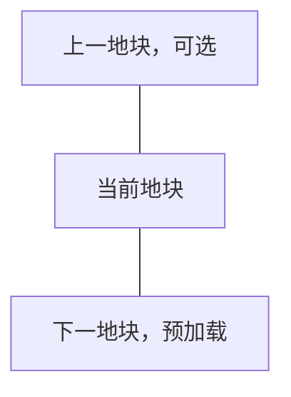

# 无缝世界地块探索

## 简述

RimWorld 的世界由大量相邻地块组成，但每个地块对应的局部地图彼此独立。Pawn 离开当前地图后，需要进入世界地图上的远行队状态，再等待目标地块生成新的局部地图。

这种结构可以表现长距离战略旅行，却无法表现 Pawn 从殖民地周边自然走入荒野的过程。玩家每跨越一个世界地块，都需要经历地图边缘撤离、世界地图移动和新地图加载，旅行体验因此被切割成多个互不连续的场景。

本 Story 计划实现一套无缝世界地块系统，使相邻世界地块对应的局部地图能够在视觉和操作上连续连接。Pawn 走到当前地图边界后，可以直接进入相邻地块的地图，而不必先组成远行队或经过显式切换界面。

本文档作为该功能的长期设计记录。开发过程中应逐步补充调研结论、技术验证结果、实现约束和后续计划。

## 背景

RimWorld 同时存在两套不同尺度的地图：

- 世界地图使用近似六边形的地块表示地理空间。
- 局部地图使用矩形格子表示殖民地、战场和事件地点。

每张局部地图只属于一个世界地块。相邻世界地块之间虽然在世界地图上直接相连，但对应的局部地图没有连续坐标关系，也不会同时显示。

当前旅行流程通常为：


这套流程适合跨越较远距离，但会产生明显的旅行割裂：

- Pawn 无法从基地门口直接走进相邻荒野。
- 玩家不能沿道路、河流或海岸连续探索。
- 追击、撤退和短距离采集会被世界地图流程中断。
- 相邻地块的地形没有空间连续性。
- 局部地图无法直观体现其在世界地图中的相邻关系。

本系统首先解决局部地图之间的连续穿越问题，不以扩大单张殖民地地图为目标。

## 理想结果

每个普通世界地块对应一张经过六边形裁切的局部地图。六条边分别对应世界地图上的六个相邻地块。

相邻局部地图满足以下关系：

- 双方边界的位置和长度可以相互映射。
- 山脉、河流、道路、海岸和主要地形在接缝处自然延续。
- Pawn 可以直接从一张地图的边界走入相邻地图。
- 相邻地图在 Pawn 到达边界前完成预加载。
- 玩家跨越接缝时不会看到显式加载界面。
- 当前未使用的远端地图可以卸载或转入低成本保存状态。

局部地图在底层仍然可以保持矩形数据结构。通过 [映射方案](./用可重叠正方形承载六边形网格的空间映射方案.md) 将一个地图边缘划分出归属归属于邻接地图的部分，以此实现用可重叠的正方形地图映射六边形密铺世界地块的效果

Pawn 穿越地块的正常流程为：


一个典型的、包含尽可能多玩家操作流程的场景是：

- 玩家在家园地块的原生地图A选中一些pawn（可能是殖民者，也可能是机械体甚至Vehicle Framework的载具）并征召
- 玩家命令pawn追击向北逃跑的敌人，pawn和敌人一起接近北侧边界
- 当接近边界时，玩家看到北侧出现了北侧相邻地块B对应的地图B
- 敌人穿过家园地块A和北侧相邻地块B边界后，玩家在地图A仍能看到敌人在地图B里继续逃跑
  - 允许先前在地图B加载完成前消失的敌人彻底消失
  - 位于地图A的pawn仍能正常射击地图B的敌人，敌人也能正常回击
- 玩家在地图A选中被征召的pawn，点击地图B的地面，要求pawn跨过边界
- 第一个pawn跨过边界计入地图B时，自动让玩家视野聚焦到地图B，并保持pawn的征召状态
  - 只有第一次有自己的pawn进入地图B时才会自动聚焦，如果玩家在第一个pawn进入地图B后切换回聚焦地图A，那么第二个pawn进入地图并不会导致再次自动聚焦
  - 玩家的摄像机位置应该自动调整，使其无感切换地图
  - pawn跨过边界进入地图B后，会继续向先前指示的地图B的目标地点移动
  - 玩家切回地图A后，可以在地图A指示地图B上还没远离边界的、仍可从地图A看见的pawn回到地图A
- 玩家的pawn击杀所有敌人后，继续向北移动到接近地块B的边界，玩家在地图B看到北侧出现了北侧相邻地块C对应的地图C
- 玩家指示pawn跨过B和C的边界，第一个进入地图C的Pawn会让玩家视野自动聚焦到地图C
- 玩家指示pawn从C继续向北
- 当所有pawn远离BC边界时，卸载地图B，但不删除也不处理，只是冻结
  - 此时如果玩家命令地图C的pawn返回B，或者让地图A的pawn前往B，会发现地面上遗留的物品还在、产生的地形修改也在
  - 需要注意一个地块只能对应一个地图，因此玩家地图A前往B的pawn和地图C前往B的pawn能汇合
- 让玩家所有pawn跨过C的北边界进入C北侧的D并远离CD边界后，卸载地图C，但不删除也不处理，只是冻结。同时删除地图B
  - 此时如果玩家再命令pawn返回C，会发现地面上遗留的物品还在、产生的地形修改也在
  - 此时如果玩家再命令pawn返回B，或者让地图A的pawn前往B，会发现地面上遗留的物品、产生的地形修改都丢失
    - 这个地方需要做得比较灵活，让玩家可以自行配置是否保留家园邻接的地图，以及家园和其他地图保留邻接的多少个地图
- 玩家让pawn跨过D的边界进入据点的情况下，我们会接管据点生成流程，保证其地图大小正常且据点建筑正常生成（rimworld默认的据点生成地图有时偏小），据点地图仍视为常规的无缝地图，以此保证整体一致

第一阶段不要求建筑、房间、电网或物流跨越地块边界。每张地图仍然是独立的 RimWorld 地图，只需要让 Pawn 的移动和玩家的观察保持连续。

## 已完成调研

目前主要调研对象为 Vehicle Map Framework，以下简称 VMF。完整源码调研已经整理到[第一阶段：VMF 调研](第一阶段-VMF调研.md)。

VMF 可以在一张真实地图上叠加额外的 Pocket Map。Vehicle Framework 中的车辆可以拥有自己的内部地图，玩家能够看到、选择和操作内部地图中的 Pawn、建筑与物品。

VMF 已经处理了多张地图同时显示时的大量基础问题，包括：

- Pocket Map 的创建、保存和加载。
- 子地图与宿主地图之间的坐标转换。
- 子地图的绘制、选取和鼠标交互。
- Pawn 在地图之间的转移。
- 部分跨地图移动、工作和战斗行为。
- 与 RimWorld 原版系统及部分 Mod 的兼容。

VMF 中还存在类似车辆楼梯的跨地图入口。Pawn 走过入口后，可以从宿主地图进入车辆内部地图。该机制与本系统需要的地块边界入口高度相似。

初步判断是：VMF 已经解决了“如何在同一场景中显示和操作多张 RimWorld 地图”这一最昂贵的问题，因此应优先验证能否将其作为依赖使用。

当前仍需验证的关键问题包括：

| 问题 | 原因 |
|---|---|
| VMF 是否支持将大部分区域放在宿主地图边界之外 | 相邻地块需要显示在当前地图外侧，而车辆地图通常位于宿主地图范围内 |
| 非车辆用途的静态地图锚点是否可行 | 地块地图没有车辆移动、燃料、载荷等需求 |
| Pocket Map 能否在不同宿主之间迁移 | Pawn 离开基地后，当前地块需要转入独立的旅行空间 |
| 多张同级 Pocket Map 能否稳定拼接 | 旅行时需要同时保留当前地块和下一个地块 |
| VMF 的地图入口能否保持玩家移动连续 | Pawn 转移后需要继续原来的移动方向 |
| 地图保存和重新载入后能否恢复接缝关系 | 该系统必须支持正常存档 |

根据验证结果，后续可以选择：

1. 直接依赖 VMF；
2. 为 VMF 增加少量通用扩展接口；
3. 保留整体设计，自行实现精简的地图叠加层。

现阶段不计划直接 fork VMF。长期 fork 会同时承担 RimWorld、Vehicle Framework 和 VMF 更新带来的维护成本。

## 预期技术路线

### 地块地图

每个已访问的世界地块可以生成一张独立的 RimWorld 局部地图。

局部地图底层仍然是矩形。系统根据世界地块形状生成六边形可活动区域，并在六边形外部放置不可通行透明地形。

这种方式可以继续使用 RimWorld 现有的：

- 格子系统；
- 寻路系统；
- 地图生成流程；
- 建筑和 Thing 管理；
- 存档机制。

六条边分别记录其对应的世界邻居和边界入口。

世界地图中少量非六边形地块需要后续单独处理。初期原型可以限制在具有六个邻居的普通地块上。

### 相邻地图叠加

当 Pawn 接近地图边界时，系统根据该边对应的世界邻居确定目标地块。

目标地块地图应在 Pawn 到达边界前完成生成，并通过 VMF 或等价机制叠加到当前场景中。

地图之间保持独立，只在接缝位置建立对应关系：

```text
当前地图出口格 N
        ↓
相邻地图入口格 N
```

玩家可以提前看到边界另一侧的地形、Pawn 和物品，从而避免进入边界后再显示加载界面。

### 跨地图入口

在每条可用边界上放置类似 VMF 车辆楼梯的跨地图传送点。

Pawn 走过传送点时：

1. 记录 Pawn 在当前边界上的相对位置。
2. 将 Pawn 从当前地图移除。
3. 在相邻地图对应的边界位置生成 Pawn。
4. 保留装备、服装、库存、健康和玩家选择状态。
5. 在相邻地图中继续原有移动方向。

这一过程在实现上属于地图转移，但在玩家看来应表现为 Pawn 连续走过地图接缝。

第一阶段只保证玩家直接命令 Pawn 穿越接缝。自动工作、搬运和远距离寻路不需要跨地图执行。

### 地块地图管理

> **架构变更说明**：原设计的"旅行 Pocket Map 宿主迁移"方案已被扁平化架构取代。详见下文。

#### 已作废：旅行宿主迁移

原设计设想"Pawn 远离基地后，当前地块不再适合依附基地地图，应创建一个独立的旅行 Pocket Map 作为宿主"。这在早期的"宿主特殊论"架构下是必要的：当时口袋地图以基地为 sourceMap，远离基地后需要把 sourceMap 迁移到旅行宿主，以避免原生财富/威胁/移除连带的父子归属误判。

第二阶段末实施的**扁平化架构**（详见 `AGENTS.md` 的"对称无缝地块架构"章节）已彻底消除这一需求：

- **所有地块的 `sourceMap` 统一指向锚点地图**（玩家家园 A），无论该地块是从 A 直接生成（A→B），还是从口袋 B 再生成（B→C），`sourceMap` 都指向 A。实现上由 `SeamlessTileGraph.GetAnchorMap` 统一解析。
- **地块间邻接关系由直接邻居表维护**（`MapParent_SeamlessTile.neighbors`，每条含 `{direction, neighbor, offset}`），不依赖 sourceMap 的父子语义。
- 因此不存在"宿主迁移"问题，也没有"旅行 Pocket Map"这一层。

代码核查已确认：全仓库无任何"改写 sourceMap 到另一个地图"的迁移逻辑（仅"生成时设锚点、卸载时置 null"两处赋值）。

#### 当前方案：基于邻居表的生命周期管理

扁平化方案下，地块生命周期管理直接作用于邻居表中的地块本身。旅行时通常只保留：

- Pawn 当前所在的地块；
- 前进方向上的下一个地块；
- 必要时保留刚刚离开的上一个地块。



Pawn 进入下一地块并远离接缝后，上一地块可以：

- 暂时缓存，以支持立即折返；
- 保存后卸载；
- 根据具体地点类型重新生成。

地块地图之间是邻居表中的对等节点，不存在多层 Pocket Map 嵌套。

#### 备忘：锚点地图被丢弃时的转正逻辑

未来需要处理一种边缘情况：玩家锚点地图本身被丢弃（例如逆重飞船起飞后家园地图销毁）时，需要将某个现存的口袋地图"转正"为新锚点，并把其他口袋地图挂到它上面。这与原"旅行宿主迁移"是完全不同的问题（善后逻辑而非旅行过程），目前阶段仅需记录，非近期工作。

### 连续地形生成

默认的 RimWorld 地图生成器会独立生成每个地块，因此相邻地图的接缝通常不会自然对应。

本系统需要为每一对相邻世界地块建立共享的边界生成条件。

接缝两侧至少需要共享：

- 高度与山体轮廓；
- 水域和海岸线；
- 河流入口；
- 道路入口；
- 土壤和主要地形类型；
- 植被密度的整体趋势。

相邻地块应根据相同的边界种子生成接缝数据。例如 A 与 B 之间的接缝，无论先生成哪一侧，都应得到相同的山体、道路和河流位置。

地图内部仍然可以使用原版或其他地图生成 Mod 的逻辑。接近边界时，将内部生成结果逐渐混合到共享边界条件，使过渡保持自然。

第一阶段只需要验证简单地形能够正确对齐。完整兼容各类地图生成 Mod 属于后续工作。

## 功能边界

该系统的核心职责是提供地块之间的连续旅行。

计划支持：

- Pawn 从当前地块直接进入相邻地块。
- 相邻地图的提前加载和场景叠加。
- 地块之间的位置映射。
- 六边形地图裁切。
- 相邻地形的连续生成。
- 当前、上一和下一地块的生命周期管理。
- 地块之间的往返和连续探索。

初期不要求支持：

- 跨地块建造建筑。
- 跨地块房间。
- 跨地块电网、管网或仓储区。
- 自动工作跨地图寻找目标。
- 普通搬运任务跨地图执行。
- 射弹、爆炸、火灾和温度跨越接缝。
- 敌人无限距离追击。
- 将多个地块组合成一座超大型殖民地。

这些能力会显著扩大跨地图兼容范围，并不是实现连续旅行所必需的条件。

## 当前阶段计划

本文档保留总体目标、技术路线和阶段路线图。阶段内的调查与实现细节分别记录在独立文档中，并随开发持续更新。

> **阶段重排说明**：原五阶段路线图（VMF 调研 → 最小技术原型 → 旅行 Pocket Map → 六边形裁切 → 连续地形）在第二阶段实际编码后做了调整。原因有四：
>
> 1. **旅行 Pocket Map 宿主迁移已被扁平化架构作废**——所有口袋地图 `sourceMap` 统一指向锚点 A，无宿主迁移逻辑（详见上文"地块地图管理"节）。
> 2. **六边形所有权语义已在第二阶段被迫预实现**——`SeamlessTileRegistry.TryGetOwnerPocketMap` 的最近中心规则就是六边形 Voronoi 模型的雏形。六边形不是纯展示层问题，其几何会渗透到坐标反查、点击归属、传送点放置等所有底层逻辑。越早把六边形几何定型越好。
> 3. **连续地形依赖稳定的边界几何**，理应紧跟六边形。
> 4. **跨地图寻路与射击应放最后**——VMF 经验表明这是最脆弱、版本最敏感的部分（IL Transpiler 替换 `Thing.Map`/`Position`），前期架构变动易使其返工。

当前按以下顺序推进。

### 1. 整理 VMF 调研结果（已完成）

完整调研、源码位置和架构结论见[第一阶段：VMF 调研](第一阶段-VMF调研.md)。

本阶段确认：

- `PocketMapParent` 与 `sourceMap` 是可复用的 RimWorld 原生宿主机制。
- VMF 的坐标统一、跨地图寻路和跨地图射击模型值得参考。
- VMF 的车辆地图渲染管线与移动载具强耦合，不适合直接承担大尺寸静态相邻地块。
- 相邻地图可以绘制在宿主边界外，但必须单独处理宿主 `MapEdgeClipDrawer` 和各 `SectionLayer` 的专用渲染语义。

### 2. 建立最小技术原型（进行中）

实现进度、验证结果、已解决问题和剩余验证项见[第二阶段：最小技术原型](第二阶段-最小技术原型.md)。

当前已经完成矩形相邻地图的生成与可测试渲染通路，并验证：

- 口袋地形可稳定显示在宿主地图边界外。
- 5 格重叠带中由宿主地形覆盖口袋地形。
- 水深层不会被误画进主相机。
- 四向拖动和缩放不再留下蓝红残影。
- 裁剪平面只在真实 footprint 上开洞，其他区域继续正常遮蔽。

此外，第二阶段在矩形原型中已**预实现了六边形所有权的雏形**——`SeamlessTileRegistry.TryGetOwnerPocketMap` 采用最近中心规则（Voronoi 模型）决定重叠带内格子的归属，与 `doc/用可重叠正方形承载六边形网格的空间映射方案.md` 一致，为阶段 3 的完整六边形几何铺路。

第二阶段尚需完成选择与移动命令、自动入口、双向 Pawn 转移以及保存读档恢复的游戏内验证。

### 3. 实现六边形裁切

在矩形地图中生成六边形可活动区域。

第二阶段的矩形原型已用最近中心所有权规则（`TryGetOwnerPocketMap`）处理重叠带归属，本阶段将其正式化为完整的六边形几何：六条边分别对应六个世界邻居，可活动区域为六边形，六边形外部为不可通行透明虚空地形。

验证：

- 六条边可以分别映射到六个世界邻居。
- 边界入口长度和位置可以稳定计算。
- Pawn 无法进入六边形外部区域。
- 六边形外部区域不会产生建筑、植物、Pawn 或事件目标。
- 地图接缝可以准确对齐。

### 4. 实现连续地形原型

首先选择一种简单地形，例如平原或山地。本阶段依赖阶段 3 稳定的六边形边界几何。

验证相邻地图可以共享：

- 边界高度；
- 一条道路；
- 一条河流或水域；
- 基础地形分布。

连续地形验证通过后，再评估原版地图生成器和地图生成 Mod 的兼容方式。

> **阶段4 调研结论**：连续地形四项的可行性分级、异步加载可行性、共因 bug 分析已整理到 [第四阶段：连续地形调研](第四阶段-连续地形.md)。核心结论：
> - 高度/地形/岩石对齐**完全可做**（Perlin seed 只是哈希系数，`GetValue` 是纯函数）；河流**部分能做**（几何可锚定，弯曲各自独立）；道路**基本不能做**（A* 寻路强依赖整图地形，接缝重合不可能）。
> - 异步加载：子类化 Map 不可行（`sealed`）；新方向"延迟 AddMap"理论上可行（4 核心 patch + 需验证 SignalManager/Pawn/Comp 雷区），建议独立实验分支。
> - 共因 bug（`map.Tile=0` 导致岩石类型/道路数据全读 tile 0）本轮已修复（patch `RockNoises.Init`）。
> - **本轮已落地**：边界带不可建造约束（安全前提）+ 共因 bug 修复。连续地形四项实现留待后续轮次按调研报告分项推进（高度/地形优先）。

#### 边界带不可建造约束（安全前提）

**这是阶段3 → 阶段4 衔接的安全约束，必须在阶段4 早期实现。**

- **动机**：阶段3 的跨图传送依赖"传送点只在对侧可达时才被 goto 寻路激活"。但玩家可以在接缝重叠带及其内侧建造建筑，用建筑改变寻路把 pawn 困在 void 一侧——一旦 pawn 站上指向"已被建筑封死对端"的传送点，就会卡死。因此接缝带附近必须禁止玩家建造，从根上杜绝这种滥用。
- **范围**：每张地块多边形边内侧 N 格的环形带（N 初步 = `SeamOverlap`(2) + 1 = 3 格，由独立 ModSettings 字段 `noBuildBorderDistance` 控制，不复用 `borderPreloadDistance`(15)——后者是预加载触发距离，语义不同）。
- **实现机制**（基于反编译调研）：
  - **patch 点**：Harmony Prefix patch `GenConstruct.CanPlaceBlueprintAt`（`RimWorld/GenConstruct.cs:231`）。这是所有玩家建造路径（手动 `Designator_Build`/`Designator_Install`、自动重建 `ThingUtility`、Sketch、Prefab、BaseGen）的**唯一汇聚点**——grep 验证所有 designator 的 `CanDesignateCell` 都直接委托给它。
  - **判定**：Prefix 内遍历 `GenAdj.OccupiedRect(center, rot, entDef.Size)`，任一格落在禁建带 → 设 `__result = new AcceptanceReport("RimExodus_BorderNoBuild".Translate())` 并 `return false`（跳过原方法）。
  - **数据源**：在 `SeamlessBorderLookup` 加 `IsInNoBuildBand(cell)` + 独立的 `noBuildBandCells` 速查表（带宽由 `noBuildBorderDistance` 控制），复用现有 `ComputeEdgeBand` 凸多边形内缩算法构建。
  - **godMode 放行**：与原生 `InNoBuildEdgeArea` 一致，开发模式可建（`if (godMode) return true;`）。
  - **ignoreEdgeArea 参数**：建议**不尊重**（世界几何约束，攻城者也不该跨地块缝建），但对 `SiegeBlueprintPlacer`/BaseGen 做兼容性测试。
  - **原生范式参照**：`InNoBuildEdgeArea`（`Verse/GenGrid.cs:14-25`，地图边缘 10 格禁建，`CanPlaceBlueprintAt` 第 244-247 行调用）+ `GenDraw.DrawNoBuildEdgeLines`（视觉提示，可选体验增强）。
- **否决的方案**：
  - 改 terrain affordance：无 affordance need 的建筑（墙、门）绕过 `CanBuildOnTerrain` 检查（该方法只在 `terrainAffordanceNeed != null` 时检查），挡不住，**不可行**。
  - PlaceWorker：per-Def（`BuildableDef.PlaceWorkers`），无法"某区域禁所有建筑"，**不可行**。
  - Zone/Area：原生 `Zone`/`Area`（含 `Area_Allowed`/`Area_Home`）全部不参与建造可行性检查，**不可行**。

### 5. 实现跨地图寻路与射击

实现 Pawn 跨地块追击入侵者所需的能力：跨地图寻路、跨地图视线、跨地图目标搜索与射击。

本阶段依赖"坐标统一映射到宿主地图"模型，可参考 VMF 的架构思路（`GenSightOnVehicle` 的跨图 LOS、`AttackTargetFinderOnVehicle` 的跨图目标搜索、`VerbOnVehicleUtility` 的跨图射击线、`Patches_Verb` 的弹道坐标替换），但**自行实现而非依赖 VMF**——原因有二：其一，VMF 的地图与载具绑死，难以剥离复用；其二，VMF 依赖 Vehicle Framework，而本 mod 的用户不应为了使用本 mod 而被迫安装 Vehicle Framework。

放最后的原因：VMF 经验表明跨图射击是整套框架里最脆弱、版本最敏感的部分（IL Transpiler 级别的 `Thing.Map`/`Position` 替换），前期架构（六边形几何、连续地形、坐标映射）变动极易使其返工。

验证：

- 跨地图视线（LOS）：位于地图 A 的 Pawn 能看到地图 B 的敌人。
- 跨地图目标搜索：地图 A 的征召 Pawn 能把地图 B 的敌人列为攻击目标。
- 跨地图射击线：能找到从地图 A 射击到地图 B 目标的弹道。
- 跨地图弹道：射弹能跨越地块边界命中目标。

### ~~已作废：旅行 Pocket Map 宿主迁移~~

原"阶段 3：验证旅行 Pocket Map"（Pawn 远离基地后把当前地块 sourceMap 迁移到旅行宿主）已被扁平化架构彻底取代。详见上文"地块地图管理 → 已作废：旅行宿主迁移"节。唯一残留的边缘情况（锚点地图被丢弃时的口袋转正）作为备忘，非近期工作。

## 当前阶段结果

- VMF 调研已经结束，结论见[第一阶段：VMF 调研](第一阶段-VMF调研.md)。
- 已选择“复用原生 Pocket Map 宿主机制，自行实现静态地图叠加渲染”的路线，不直接依赖 VMF 的车辆渲染管线。
- 矩形原型的生成和边界外渲染已经通过游戏内验证，详情见[第二阶段：最小技术原型](第二阶段-最小技术原型.md)。
- 第二阶段接下来集中验证交互、双向转移与保存读档；六边形裁切、连续地形、跨地图寻路与射击按后续阶段（3/4/5）推进。
- 旅行 Pocket Map 宿主迁移已被扁平化架构作废（所有地块 sourceMap 统一指向锚点 A），详见上文“地块地图管理”节。
- 第四阶段（连续地形）调研已完成，结论见[第四阶段：连续地形调研](第四阶段-连续地形.md)。本轮落地：边界带不可建造约束（安全前提）+ 共因 bug 修复（`map.Tile=0` 导致岩石类型读 tile 0）。连续地形四项分轮推进。

## 后续记录

开发过程中应继续在本文档中补充：

- 调研日期和对应 VMF 版本。
- 已验证和未验证的行为。
- 原型截图或录像。
- 关键源码位置。
- 性能测试结果。
- 存档兼容结果。
- 已发现的 Mod 冲突。
- 技术决策及其原因。
- 被否决的方案。
- 后续 Story 和任务链接。

涉及该工作流的实现发生变化时，应同步更新相关 README、开发文档、本地化文本和兄弟 Story，使术语、状态和实际行为保持一致。
