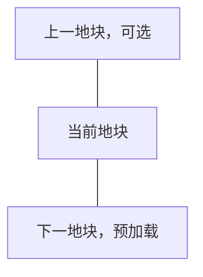

# 无缝世界地块探索

## 简述

RimWorld 的世界由大量相邻地块组成，但每个地块对应的局部地图彼此独立。Pawn 离开当前地图后，需要进入世界地图上的远行队状态，再等待目标地块生成新的局部地图。

这种结构可以表现长距离战略旅行，却无法表现 Pawn 从殖民地周边自然走入荒野的过程。玩家每跨越一个世界地块，都需要经历地图边缘撤离、世界地图移动和新地图加载，旅行体验因此被切割成多个互不连续的场景。

本 Story 计划实现一套无缝世界地块系统，使相邻世界地块对应的局部地图能够在视觉和操作上连续连接。Pawn 走到当前地图边界后，可以直接进入相邻地块的地图，而不必先组成远行队或经过显式切换界面。

本文档作为该功能的长期设计记录。开发过程中应逐步补充调研结论、技术验证结果、实现约束和后续计划。

## 背景

RimWorld 同时存在两套不同尺度的地图：

- 世界地图使用近似六边形的地块表示地理空间。
- 局部地图使用矩形格子表示殖民地、战场和事件地点。

每张局部地图只属于一个世界地块。相邻世界地块之间虽然在世界地图上直接相连，但对应的局部地图没有连续坐标关系，也不会同时显示。

当前旅行流程通常为：


这套流程适合跨越较远距离，但会产生明显的旅行割裂：

- Pawn 无法从基地门口直接走进相邻荒野。
- 玩家不能沿道路、河流或海岸连续探索。
- 追击、撤退和短距离采集会被世界地图流程中断。
- 相邻地块的地形没有空间连续性。
- 局部地图无法直观体现其在世界地图中的相邻关系。

本系统首先解决局部地图之间的连续穿越问题，不以扩大单张殖民地地图为目标。

## 理想结果

每个普通世界地块对应一张经过六边形裁切的局部地图。六条边分别对应世界地图上的六个相邻地块。

相邻局部地图满足以下关系：

- 双方边界的位置和长度可以相互映射。
- 山脉、河流、道路、海岸和主要地形在接缝处自然延续。
- Pawn 可以直接从一张地图的边界走入相邻地图。
- 相邻地图在 Pawn 到达边界前完成预加载。
  （2026-08 审计定夺注：已降级为**非目标**——传送点对端未加载本来就不工作[无危害路径]，且生成速度受植被数量等大幅影响，从数据角度无法保证时限；实际行为 = 事件驱动尽力预加载[边界带触发 + 分帧增量生成]，玩家接近时若尚未生成完成则等待，无硬时限承诺。）
- 玩家跨越接缝时不会看到显式加载界面。
- 当前未使用的远端地图可以卸载或转入低成本保存状态。
  （2026-08 注：实现取**软休眠**路线——Map 保留在 `Find.Maps` 不卸载、全量随档序列化，只停 tick/摘邻接显示/关访问入口；"卸载（卸 Map 留 WorldObject）"仅作预埋保留，用户定夺勿回退为卸载方案。）

局部地图在底层仍然可以保持矩形数据结构。通过 [映射方案](./用可重叠正方形承载六边形网格的空间映射方案.md) 将一个地图边缘划分出归属邻接地图的部分，以此实现用可重叠的正方形地图映射六边形密铺世界地块的效果

Pawn 穿越地块的正常流程为：


一个典型的、包含尽可能多玩家操作流程的场景是：

- 玩家在家园地块的原生地图A选中一些pawn（可能是殖民者，也可能是机械体甚至Vehicle Framework的载具）并征召
- 玩家命令pawn追击向北逃跑的敌人，pawn和敌人一起接近北侧边界
- 当接近边界时，玩家看到北侧出现了北侧相邻地块B对应的地图B
- 敌人穿过家园地块A和北侧相邻地块B边界后，玩家在地图A仍能看到敌人在地图B里继续逃跑
  - 允许先前在地图B加载完成前消失的敌人彻底消失
  - 位于地图A的pawn仍能正常射击地图B的敌人，敌人也能正常回击
- 玩家在地图A选中被征召的pawn，点击地图B的地面，要求pawn跨过边界
- 第一个pawn跨过边界计入地图B时，自动让玩家视野聚焦到地图B，并保持pawn的征召状态
  - 只有第一次有自己的pawn进入地图B时才会自动聚焦，如果玩家在第一个pawn进入地图B后切换回聚焦地图A，那么第二个pawn进入地图并不会导致再次自动聚焦
  - 玩家的摄像机位置应该自动调整，使其无感切换地图
  - pawn跨过边界进入地图B后，会继续向先前指示的地图B的目标地点移动
  - 玩家切回地图A后，可以在地图A指示地图B上还没远离边界的、仍可从地图A看见的pawn回到地图A
- 玩家的pawn击杀所有敌人后，继续向北移动到接近地块B的边界，玩家在地图B看到北侧出现了北侧相邻地块C对应的地图C
- 玩家指示pawn跨过B和C的边界，第一个进入地图C的Pawn会让玩家视野自动聚焦到地图C
- 玩家指示pawn从C继续向北
- 当所有pawn跨过C的北边界进入C北侧的D并远离CD边界后，地图B距玩家所在地图达到2跳，进入软休眠（保留在内存与存档中、停止tick与邻接显示，但不卸载）
  - 此时如果玩家命令地图C的pawn返回B，或者让地图A的pawn前往B，会发现地面上遗留的物品还在、产生的地形修改也在（走近时自动唤醒）
  - 需要注意一个地块只能对应一个地图，因此玩家地图A前往B的pawn和地图C前往B的pawn能汇合
- 当pawn继续深入、地图C也距玩家达到2跳时，地图C同样进入软休眠；地图B达到3跳后被删除（视为"从未出现过"，再次进入时重新生成，此前的物品与地形修改丢失；家园地图永不删除——"家园"判定唯一出处 = `SeamlessMapGovernance.IsProtectedHome`，2026-08 起"锚点"概念已废弃）
  - 此时如果玩家再命令pawn返回C，会发现地面上遗留的物品还在、产生的地形修改也在
  - 此时如果玩家再命令pawn返回B，或者让地图A的pawn前往B，会发现地面上遗留的物品、产生的地形修改都丢失
    - 保留距离可配置：休眠跳数与删除跳数两个设置（默认2跳休眠、3跳删除），调大删除跳数即可保留更多地图
- 玩家让pawn跨过D的边界进入据点的情况下，我们会接管据点生成流程，保证其地图大小正常且据点建筑正常生成（rimworld默认的据点生成地图有时偏小），据点地图仍视为常规的无缝地图，以此保证整体一致

第一阶段不要求建筑、房间、电网或物流跨越地块边界。每张地图仍然是独立的 RimWorld 地图，只需要让 Pawn 的移动和玩家的观察保持连续。

## 预期限制

和空岛（skyblock）mod 可能不兼容，它生成空岛时可能会把我们的传送点和void切分都清掉，而且其玩家派系据点的移动逻辑我也没去看，没准会产生其他bug……而且说实话我也不觉得玩空岛的时候需要这个mod提供的无缝远行能力

一些据点的特殊行为可能需要回到大地图上触发（比如金鸢尾兰的外交选项），我具体看下逻辑才能确认能不能通过将其加入据点贸易商pawn的对话列表里来实现
（2026-08 注：该设想已随 Settlement 接入落地——贸易商对话面板"远行者，你想要做什么？"的选项即据点 `GetGizmos()` 枚举项，mod 经 WorldObjectComp 添加的据点交互天然出现在面板中；原版"进攻"在 GetCaravanGizmos 不在其中。见 doc/地图滚动休眠.md 2.11 末段）
（2026-08 二次注：上注只覆盖了据点 gizmo 一半——用户实测金鸢尾兰的**远行队**交互 gizmo 缺失后确立完整模型"据点图上的玩家 pawn 就是远行队"：面板补入**影子远行队**采集的 `Settlement.GetCaravanGizmos(shadow)` 全集（交易/送礼/满足贸易请求/mod 远行队交互），交易改走原版 `CaravanVisitUtility.TradeCommand`（谈判者 = 图上最优谈判者）。机制与硬约束见 `Source/Lifecycle/SeamlessShadowCaravan.cs` 类注释与 `AGENTS.md` Settlement 四件套 ③）
（2026-08-26 三次注：二次注首版的"同帧借用临时实例"已被实测否决并升级为 **v2 常驻实例**（用户方案）——金鸢尾兰"外交交互"的 Command_Action 只打开 FloatMenu，真正的 `FindBestDiplomat` 在玩家点浮菜单的后续帧闭包里执行，同帧借出窗口早已归还 → 空列表 → "无外交官"。v2 = 每个"有玩家自由殖民者的据点图"常驻一个影子 Caravan（60 ticks 周期同步成员名单），配三个 patch 抑制副作用：`Caravan.TickInterval` 按实例跳过（零需求双计/库存消耗）、`CaravanUtility.GetCaravan` 对影子返回 null（还原原版 ~40 处消费面的地图语义）、`Caravan.GetGizmos` 清空（防世界图下令移动影子）。影子不序列化：存档前全量拆除、读档自动重建。细节与观察项见 `AGENTS.md` 同节）

一些异象天气的生成机制没有细究，如果没打夜光柱直接离开，可能无法再解除异常黑暗天气

没有细究外太空的地图工作如何

不确定和Geological Landforms的地形生成兼容性如何，但应该就是多几个genStep应该问题不大
（2026-08 注：实际有问题，它patch了原版地图生成管线，但绝大多数地图我们都使用了我们的分帧管线来避免过于割裂的加载，我们只在settlement和site上使用原版管线以保证其他mod高度自定义的结构一次性生成来避免时序问题，这导致大部分地图上它的patch没有起效。而通过patch来让原版管线分帧化在调研中被证明不具备工程可行性（因为 GenerateContentsIntoMap 是同步整段执行 genStep 循环的方法——调用它就等于放弃分帧（单帧跑完全部步骤，回到 3 秒卡顿）。把它的 head-loop-tail 拆帧的三条路（transpiler / 异常展开 / 提前跑 tail）在 Settlement 分帧化的方向否决里已经全部论证过不可行，这里是同一个结论的另一个应用面。））
（2026-08 二注：已修复并游戏内回归通过，共两轮。第一轮 = `SeamlessLandformsCompat` 在增量分帧路径上软反射复刻 GL 的 Prefix/Postfix 语义（Prepare 静态上下文 + BiomeGrid 初始化 + BiomeVariants(225)/CustomGenSteps 运行时注入 + 分帧竞争守卫）——上注"patch 没有起效"的工程化解法，而非让原版管线分帧化。第二轮 = 同族残留两个症状（营地图 landform 永久失效 / 地块图存在期间 MapPreview 预览丢 GL）同一根因：GL 的 CheckWorldObject 把无派系的 `RimExodus_SeamlessTileMap` parent 当外来 site 归零该 tile 全部 landform commonness（营地链生成前 Add parent 触发过滤 + GL 的 CommitDirectly 把空列表烧进世界数据造成"永久"；地块图 parent 常驻期间预览/运行时 Mutators 查询同被过滤，图销毁自愈）——修复 = 启动时反射注册 defName 进 GL 的 IgnoredWorldObjects 白名单。全链机制与勿回退要点见 `AGENTS.md`"邻居预加载与异步加载"节 GL 兼容条。）

## 已完成调研

目前主要调研对象为 Vehicle Map Framework，以下简称 VMF。完整源码调研已经整理到[第一阶段：VMF 调研](第一阶段-VMF调研.md)。

> **路线变更说明**：VMF 调研阶段基于 Pocket Map（口袋地图）宿主机制设计的方案已在后续阶段废弃。当前采用**基础地图对等架构**——所有地块都是独立的基础地图（继承原生 `MapParent`，非 `PocketMapParent`），通过直接邻居表（`NeighborLink`）维护接缝关系，不依赖 `sourceMap`/`IsPocketMap` 的宿主-口袋语义。下文保留原始调研内容作为历史记录，其中关于 Pocket Map 机制的具体描述（创建/宿主迁移/边界外渲染）均已不适用于当前实现。当前架构详见 `AGENTS.md` 与 [第三阶段：六边形裁切](第三阶段-六边形裁切.md)、[第四阶段a：预加载与传送机制](第四阶段a-预加载与传送机制.md)。

VMF 可以在一张真实地图上叠加额外的 Pocket Map。Vehicle Framework 中的车辆可以拥有自己的内部地图，玩家能够看到、选择和操作内部地图中的 Pawn、建筑与物品。

VMF 已经处理了多张地图同时显示时的大量基础问题，包括：

- Pocket Map 的创建、保存和加载。
- 子地图与宿主地图之间的坐标转换。
- 子地图的绘制、选取和鼠标交互。
- Pawn 在地图之间的转移。
- 部分跨地图移动、工作和战斗行为。
- 与 RimWorld 原版系统及部分 Mod 的兼容。

VMF 中还存在类似车辆楼梯的跨地图入口。Pawn 走过入口后，可以从宿主地图进入车辆内部地图。该机制与本系统需要的地块边界入口高度相似。

初步判断是：VMF 已经解决了“如何在同一场景中显示和操作多张 RimWorld 地图”这一最昂贵的问题，因此应优先验证能否将其作为依赖使用。

当前仍需验证的关键问题包括（**下表为 VMF 依赖路线时期的问题清单，仅存历史**：Pocket Map 相关行已随基础地图对等架构作废；"地图入口保持移动连续"与"存档后恢复接缝关系"已由自研实现验证；本 mod 最终未依赖 VMF）：

| 问题 | 原因 |
|---|---|
| VMF 是否支持将大部分区域放在宿主地图边界之外 | 相邻地块需要显示在当前地图外侧，而车辆地图通常位于宿主地图范围内 |
| 非车辆用途的静态地图锚点是否可行 | 地块地图没有车辆移动、燃料、载荷等需求 |
| Pocket Map 能否在不同宿主之间迁移 | Pawn 离开基地后，当前地块需要转入独立的旅行空间（**已作废**，见下文"地块地图管理"节：扁平化架构用直接邻居表，无宿主迁移） |
| 多张同级 Pocket Map 能否稳定拼接 | 旅行时需要同时保留当前地块和下一个地块 |
| VMF 的地图入口能否保持玩家移动连续 | Pawn 转移后需要继续原来的移动方向 |
| 地图保存和重新载入后能否恢复接缝关系 | 该系统必须支持正常存档 |

根据验证结果，后续可以选择：

1. 直接依赖 VMF；
2. 为 VMF 增加少量通用扩展接口；
3. 保留整体设计，自行实现精简的地图叠加层。

现阶段不计划直接 fork VMF。长期 fork 会同时承担 RimWorld、Vehicle Framework 和 VMF 更新带来的维护成本。

## 预期技术路线

### 地块地图

每个已访问的世界地块可以生成一张独立的 RimWorld 局部地图。

局部地图底层仍然是矩形。系统根据世界地块形状生成六边形可活动区域，并在六边形外部放置不可通行透明地形。

这种方式可以继续使用 RimWorld 现有的：

- 格子系统；
- 寻路系统；
- 地图生成流程；
- 建筑和 Thing 管理；
- 存档机制。

六条边分别记录其对应的世界邻居和边界入口。

世界地图中少量非六边形地块需要后续单独处理。初期原型可以限制在具有六个邻居的普通地块上。
（2026-08 注：已覆盖——`SeamlessPolygonGeometry` 全部几何方法统一遍历 N 个顶点（N=5 或 6 通用，内切圆模型顶点计算不分形状），五边形地块已纳入正常链路，无需单独处理。）

### 相邻地图叠加

当 Pawn 接近地图边界时，系统根据该边对应的世界邻居确定目标地块。

目标地块地图应在 Pawn 到达边界前完成生成，并通过 VMF 或等价机制叠加到当前场景中。

地图之间保持独立，只在接缝位置建立对应关系：

```text
当前地图出口格 N
        ↓
相邻地图入口格 N
```

玩家可以提前看到边界另一侧的地形、Pawn 和物品，从而避免进入边界后再显示加载界面。

### 跨地图入口

在每条可用边界上放置类似 VMF 车辆楼梯的跨地图传送点。

Pawn 走过传送点时：

1. 记录 Pawn 在当前边界上的相对位置。
2. 将 Pawn 从当前地图移除。
3. 在相邻地图对应的边界位置生成 Pawn。
4. 保留装备、服装、库存、健康和玩家选择状态。
5. 在相邻地图中继续原有移动方向。

这一过程在实现上属于地图转移，但在玩家看来应表现为 Pawn 连续走过地图接缝。

第一阶段只保证玩家直接命令 Pawn 穿越接缝。自动工作、搬运和远距离寻路不需要跨地图执行。

> **2026-08 现状**：已远超"第一阶段"口径——玩家点击下令的跨图命令（移动/攻击/开采/砍伐/搬运/驯服等，适配边界见[跨图命令适配审计](跨图命令适配审计.md)）、NPC 撤离/追击/跟随、敌人跨图推进与交战均已实现；自动工作跨图寻找目标仍不支持。

### 地块地图管理

> **架构变更说明**：原设计的"旅行 Pocket Map 宿主迁移"方案已被扁平化架构取代。详见下文。

#### 已作废：旅行宿主迁移

原设计设想"Pawn 远离基地后，当前地块不再适合依附基地地图，应创建一个独立的旅行 Pocket Map 作为宿主"。这在早期的"宿主特殊论"架构下是必要的：当时口袋地图以基地为 sourceMap，远离基地后需要把 sourceMap 迁移到旅行宿主，以避免原生财富/威胁/移除连带的父子归属误判。

该方案经历了两次取代：

- **中间方案：扁平化架构（阶段2 末实施，历史）**——所有口袋地块的 `sourceMap` 统一指向锚点地图（家园 A），消除了"迁移"需求，但仍是 Pocket Map 宿主语义。
- **现行最终态：基础地图对等架构**——彻底移除 `sourceMap`/`IsPocketMap`/`pocketMaps` 语义，所有地块都是基础地图（`MapParent_SeamlessTile : MapParent`），无任何宿主-口袋关系；锚点图（家园 A）也只是普通 MapParent，其邻居表存于 `SeamlessTileManager`（MapComponent）。地块间邻接由直接邻居表维护（`MapParent_SeamlessTile.neighbors`，每条含 `{worldTile, neighbor, offset}`，`worldTile` 是主键、无 direction 字段）。

因此不存在"宿主迁移"问题，也没有"旅行 Pocket Map"这一层。代码核查已确认：全仓库无任何"改写 sourceMap 到另一个地图"的迁移逻辑。

#### 当前方案：基于邻居表的生命周期管理

扁平化方案下，地块生命周期管理直接作用于邻居表中的地块本身。旅行时通常只保留：

- Pawn 当前所在的地块；
- 前进方向上的下一个地块；
- 必要时保留刚刚离开的上一个地块。



Pawn 进入下一地块并远离接缝后，上一地块可以：

- 暂时缓存，以支持立即折返；
- 保存后卸载；
- 根据具体地点类型重新生成。

地块地图之间是邻居表中的对等节点，不存在多层 Pocket Map 嵌套。

#### 已消解：锚点地图销毁的善后（2026-08 天气域机制取代）

**无锚点特殊论（用户定夺 2026-08）：永远不设"锚点"地图。** 天气等共享状态按**群系连通域**组织（`SeamlessWeatherClusterManager` 全局注册机制）：同群系且世界图邻接连通的图共享一个天气源，跨群系边界切断传递（雨林→温带→另一片不连通雨林 = 三个独立域）；宿主 = 域内最小 tileId 图，图移除/读档后自动重算改绑——任何图（含家园图）销毁都无特殊善后。旧 Pocket Map 时代的"口袋转正"表述与早期"锚点天气共享"一并废弃。

### 连续地形生成

默认的 RimWorld 地图生成器会独立生成每个地块，因此相邻地图的接缝通常不会自然对应。

本系统需要为每一对相邻世界地块建立共享的边界生成条件。

接缝两侧至少需要共享：

- 高度与山体轮廓；
- 水域和海岸线；
- 河流入口；
- 道路入口；
- 土壤和主要地形类型；
- 植被密度的整体趋势。

相邻地块应根据相同的边界种子生成接缝数据。例如 A 与 B 之间的接缝，无论先生成哪一侧，都应得到相同的山体、道路和河流位置。

地图内部仍然可以使用原版或其他地图生成 Mod 的逻辑。接近边界时，将内部生成结果逐渐混合到共享边界条件，使过渡保持自然。

第一阶段只需要验证简单地形能够正确对齐。完整兼容各类地图生成 Mod 属于后续工作。

> **实际实现方案（阶段4）**：上述"完整连续性"（高度/水域/河流/道路入口全局对齐）经深入调研后降级。根因是 RimWorld 的 elevation 噪声被 Rotate/Scale/AddDisplacementNoise 等组合器包裹，无法在叶子层做全局坐标对齐；道路是 A* 寻路生成，强依赖整图通行成本，两端独立寻路结果必然不同。**当前实现采用"接缝覆写卷积混合"**：各地块正常用原版噪声独立生成，只在接缝带（多边形边缘内侧 N 格）做 terrainDef 3×3 卷积加权混合 + 单向覆写，保证接缝处视觉与通行连续。完整调研结论（四项可行性分级）与实现历程见 [第四阶段：连续地形调研](第四阶段-连续地形.md) 的 B-D 节与 E 节。

## 功能边界

该系统的核心职责是提供地块之间的连续旅行。

计划支持：

- Pawn 从当前地块直接进入相邻地块。
- 相邻地图的提前加载和场景叠加。
- 地块之间的位置映射。
- 六边形地图裁切。
- 相邻地形的连续生成。
- 当前、上一和下一地块的生命周期管理。
- 地块之间的往返和连续探索。

初期不要求支持：

- 跨地块建造建筑。
- 跨地块房间。
- 跨地块电网、管网或仓储区。
- 自动工作跨地图寻找目标。
- 普通搬运任务跨地图执行。
- 射弹、爆炸、火灾和温度跨越接缝（**2026-08 已部分超出**：射弹支持缝交接；爆炸 AoE/火灾/温度仍不跨缝）。
- 敌人无限距离追击（**2026-08 已部分超出**：缝邻接范围内的追击链已支持；无限距离仍不支持）。
- 将多个地块组合成一座超大型殖民地。

这些能力会显著扩大跨地图兼容范围，并不是实现连续旅行所必需的条件。

> **2026-08 状态注**：其中两项已随阶段5 超出"初期"口径——**射弹**已支持跨缝交接（跨共享边瞬间 respawn 邻图续飞，拦截/命中原生；爆炸 AoE/火灾/温度仍不跨缝）；**敌人追击**已支持跨图（缝邻接范围内的追击链：意图判据 + 战斗踩点 + 追击 lord 接管，见 [边界行为表](边界行为表.md) 行 15/23/31）。跨地块建造/房间/电网/仓储与"自动工作跨图寻目标"仍不在范围内（玩家点击下令的跨图命令适配边界见 [跨图命令适配审计](跨图命令适配审计.md)）。

## 当前阶段计划

本文档保留总体目标、技术路线和阶段路线图。阶段内的调查与实现细节分别记录在独立文档中，并随开发持续更新。

> **阶段重排说明**：原五阶段路线图（VMF 调研 → 最小技术原型 → 旅行 Pocket Map → 六边形裁切 → 连续地形）在第二阶段实际编码后做了调整。原因有四：
>
> 1. **旅行 Pocket Map 宿主迁移已被扁平化架构作废**——所有口袋地图 `sourceMap` 统一指向锚点 A，无宿主迁移逻辑（详见上文"地块地图管理"节）。
> 2. **六边形所有权语义已在第二阶段被迫预实现**——`SeamlessTileRegistry.TryGetOwnerPocketMap` 的最近中心规则就是六边形 Voronoi 模型的雏形。六边形不是纯展示层问题，其几何会渗透到坐标反查、点击归属、传送点放置等所有底层逻辑。越早把六边形几何定型越好。
> 3. **连续地形依赖稳定的边界几何**，理应紧跟六边形。
> 4. **跨地图寻路与射击应放最后**——VMF 经验表明这是最脆弱、版本最敏感的部分（IL Transpiler 替换 `Thing.Map`/`Position`），前期架构变动易使其返工。

当前按以下顺序推进。

> **总进度（2026-08）**：阶段 1-4 已完成；**阶段 5（跨地图寻路与射击）已全部落地，游戏内回归进行中**（叙事与决策记录见 [第五阶段：跨图寻路与射击](第五阶段-跨图寻路与射击.md)）；另完成五项阶段外增量——**地图滚动软休眠**（休眠/唤醒/删除三态 + 距离策略自动调度，权威文档 [地图滚动休眠](地图滚动休眠.md)）、**营地接入生成链**（Camp 不再无人自动解散）、**原生"人走即删"地图族滚动接管**（Settlement/Site/战场等归距离策略，勿回退要点见 `AGENTS.md`"地图生命周期"节）、**其他派系 Settlement 无缝接入与据点贸易商**（走近原生生成 + 7 条件选身价最高驻军为贸易商 + "远行者，你想要做什么？"对话面板[交易 + 据 gizmo 集合，天然适配 mod 扩展交互] + 地图内交易三 patch——远行队交易零回归；设计勿回退要点见 [地图滚动休眠](地图滚动休眠.md) 2.11 末段）、**揭雾分径**（`Patch_GenStep_Fog_SeamOrigin`：初始地图原版中心揭雾 / 邻接生成只从生成方向接缝洪水揭雾 + void 全揭）与**远行队出口链接缝化**（5 参 Rot4 重载 + 区域触边六边形化——倾斜六边形图组队全链走通）。

### 1. 整理 VMF 调研结果（已完成）

完整调研、源码位置和架构结论见[第一阶段：VMF 调研](第一阶段-VMF调研.md)。

本阶段确认：

- `PocketMapParent` 与 `sourceMap` 是可复用的 RimWorld 原生宿主机制。
- VMF 的坐标统一、跨地图寻路和跨地图射击模型值得参考。
- VMF 的车辆地图渲染管线与移动载具强耦合，不适合直接承担大尺寸静态相邻地块。
- 相邻地图可以绘制在宿主边界外，但必须单独处理宿主 `MapEdgeClipDrawer` 和各 `SectionLayer` 的专用渲染语义。

### 2. 建立最小技术原型（已完成）

实现进度、验证结果、已解决问题和剩余验证项见[第二阶段：最小技术原型](第二阶段-最小技术原型.md)。

第二阶段已完成矩形相邻地图的生成与可测试渲染通路，并验证：

- 相邻地块地形可稳定显示在当前地图边界外。
- 重叠带由聚焦地图地形覆盖。
- 水深层不会被误画进主相机。
- 拖动和缩放不再留下残影。
- 裁剪平面只在真实 footprint 上开洞，其他区域继续正常遮蔽。

后续在阶段3/4a/4b 中，选择与移动命令、自动入口、双向 Pawn 转移、跨地图移动指令、保存读档恢复均已完成并游戏内验证（详见 [第三阶段：六边形裁切](第三阶段-六边形裁切.md) 与 [第四阶段a：预加载与传送机制](第四阶段a-预加载与传送机制.md)）。第二阶段在矩形原型中预实现的六边形所有权雏形（最近中心规则）已在阶段3 正式化为完整的六边形几何。

### 3. 实现六边形裁切（已完成）

在矩形地图中生成六边形可活动区域。实现细节、几何模型与验证结果见[第三阶段：六边形裁切](第三阶段-六边形裁切.md)。

第二阶段的矩形原型已用最近中心所有权规则（`TryGetOwnerPocketMap`）处理重叠带归属，本阶段将其正式化为完整的六边形几何：六条边分别对应六个世界邻居，可活动区域为六边形，六边形外部为不可通行透明虚空地形。

验证：

- 六条边可以分别映射到六个世界邻居。
- 边界入口长度和位置可以稳定计算。
- Pawn 无法进入六边形外部区域。
- 六边形外部区域不会产生建筑、植物、Pawn 或事件目标。
- 地图接缝可以准确对齐。

### 4. 实现连续地形原型（已完成）

首先选择一种简单地形，例如平原或山地。本阶段依赖阶段 3 稳定的六边形边界几何。

> **实现状态**：连续 Perlin 噪声场方案（全局高度/地形对齐）经调研与实验后废弃（elevation 被组合器包裹无法叶子层对齐）。当前采用**接缝覆写卷积混合**（E.6-E.7）：各地块独立生成，接缝带做 terrainDef 过渡混合。完整调研（四项可行性分级）与实现历程见 [第四阶段：连续地形调研](第四阶段-连续地形.md)。接缝覆写已完成游戏内验证（地形跨 tile 平滑过渡，用户确认"完美"），硬边界来源①②（卷积截断 + 权重硬夹）已在本轮修复。
>
> **接缝带定义重构（2026-08，当前权威架构）**：接缝混合按"3 圈接缝带"新架构整体重构——连续边/离散边/接缝带三圈（带内圈/离散边圈/带外圈）/传送圈/过渡带/外条带的权威定义；offset 改为连续边中点对齐（修复镜像假设导致的系统性 ±1 格渲染错位）；接缝参考数据归一为平行三层条带快照（terrain/building/roof，挂 WorldObject 序列化——兼作地图滚动加载卸载预埋与读档缺口修复）；混合规则归一（B_C 三圈三层照抄对端 + T_C 过渡带源地图轴权重卷积、离散层跟随主导参考；保护判据仅剩道路）；传送圈=离散边圈∪带外圈（spot 无可通行性预判）。清理全部归 391（依次 roof→rock→terrain，快照先备份后清理，随后 pathGrid 全量刷新；2026-08 起 void/混合 genStep 从 1400/1410 提前到 391/392，让 Settlement 及之后全部步骤在最终地形上工作——动物站 void 的历史 bug 根治，时序演变见 doc/地图生成步骤.md 反转节）。**权威定义见 [接缝带定义](接缝带定义.md)**；本文档及第三/四阶段文档中的旧接缝带/SeamOverlap 描述仅作历史记录。

验证相邻地图可以共享：

- 边界高度；
- 一条道路；
- 一条河流或水域；
- 基础地形分布。

连续地形验证通过后，再评估原版地图生成器和地图生成 Mod 的兼容方式。

> **阶段4 调研结论**：连续地形四项的可行性分级、异步加载可行性、共因 bug 分析已整理到 [第四阶段：连续地形调研](第四阶段-连续地形.md)。核心结论：
> - 高度/地形/岩石对齐**完全可做**（Perlin seed 只是哈希系数，`GetValue` 是纯函数）；河流**部分能做**（几何可锚定，弯曲各自独立）；道路**基本不能做**（A* 寻路强依赖整图地形，接缝重合不可能）。
> - 异步加载：子类化 Map 不可行（`sealed`）；新方向"延迟 AddMap"理论上可行（4 核心 patch + 需验证 SignalManager/Pawn/Comp 雷区），建议独立实验分支。
> - 共因 bug（`map.Tile=0` 导致岩石类型/道路数据全读 tile 0）本轮已修复（patch `RockNoises.Init`）。
> - **本轮已落地**：边界带不可建造约束（安全前提）+ 共因 bug 修复。连续地形四项实现留待后续轮次按调研报告分项推进（高度/地形优先）。

#### 边界带不可建造约束（安全前提）

**这是阶段3 → 阶段4 衔接的安全约束，必须在阶段4 早期实现。**

- **动机**：阶段3 的跨图传送依赖"传送点只在对侧可达时才被 goto 寻路激活"。但玩家可以在接缝重叠带及其内侧建造建筑，用建筑改变寻路把 pawn 困在 void 一侧——一旦 pawn 站上指向"已被建筑封死对端"的传送点，就会卡死。因此接缝带附近必须禁止玩家建造，从根上杜绝这种滥用。
- **范围**：每张地块多边形边内侧 N 格的环形带（N 由独立 ModSettings 字段 `borderNoBuildDistance` 控制，默认 3 格，不复用 `borderPreloadDistance`(15)——后者是预加载触发距离，语义不同）。
- **实现机制**（基于反编译调研）：
  - **patch 点**：Harmony Prefix patch `GenConstruct.CanPlaceBlueprintAt`（`RimWorld/GenConstruct.cs:231`）。这是所有玩家建造路径（手动 `Designator_Build`/`Designator_Install`、自动重建 `ThingUtility`、Sketch、Prefab、BaseGen）的**唯一汇聚点**——grep 验证所有 designator 的 `CanDesignateCell` 都直接委托给它。
  - **判定**：Prefix 内遍历 `GenAdj.OccupiedRect(center, rot, entDef.Size)`，任一格落在禁建带 → 设 `__result = new AcceptanceReport("RimExodus_BorderNoBuild".Translate())` 并 `return false`（跳过原方法）。
  - **数据源**：在 `SeamlessBorderLookup` 加 `IsInNoBuildBand(cell)` + 独立的 `noBuildBandCells` 速查表（带宽由 `borderNoBuildDistance` 控制），用 `ComputeVoidBand`（void 边界 + 多轮膨胀，与传送点带/接缝覆写带同源）构建。
  - **godMode 放行**：与原生 `InNoBuildEdgeArea` 一致，开发模式可建（`if (godMode) return true;`）。
  - **ignoreEdgeArea 参数**：建议**不尊重**（世界几何约束，攻城者也不该跨地块缝建），但对 `SiegeBlueprintPlacer`/BaseGen 做兼容性测试。
  - **原生范式参照**：`InNoBuildEdgeArea`（`Verse/GenGrid.cs:14-25`，地图边缘 10 格禁建，`CanPlaceBlueprintAt` 第 244-247 行调用）+ `GenDraw.DrawNoBuildEdgeLines`（视觉提示，可选体验增强）。
- **否决的方案**：
  - 改 terrain affordance：无 affordance need 的建筑（墙、门）绕过 `CanBuildOnTerrain` 检查（该方法只在 `terrainAffordanceNeed != null` 时检查），挡不住，**不可行**。
  - PlaceWorker：per-Def（`BuildableDef.PlaceWorkers`），无法"某区域禁所有建筑"，**不可行**。
  - Zone/Area：原生 `Zone`/`Area`（含 `Area_Allowed`/`Area_Home`）全部不参与建造可行性检查，**不可行**。

### 5. 实现跨地图寻路与射击（已实现，游戏内回归进行中）

实现 Pawn 跨地块追击入侵者所需的能力：跨地图寻路、跨地图视线、跨地图目标搜索与射击。

> **阶段叙事与决策记录见 [第五阶段：跨图寻路与射击](第五阶段-跨图寻路与射击.md)**（实现历程 / 用户定夺偏离 / 历轮断链存档索引 / 回归清单）。权威规格分属：[边界行为表](边界行为表.md)（传送点行为）、[地图滚动休眠](地图滚动休眠.md)（休眠生命周期）、[跨图命令适配审计](跨图命令适配审计.md)（命令矩阵）、`AGENTS.md` 各节（机制事实与勿回退要点）。

> **进度（2026-08）**：本阶段的**边界行为**部分已落地——传送许可登记制（Bridge/Evacuation/Pursue/Follow 四类 Grant + 撤离链 VisitedTiles 防回弹 + 追击/跟随扫描 + 游荡兜底），权威规格见 [边界行为表](边界行为表.md)。
> **跨图视线/目标搜索/射击线/弹道已实现（2026-08，待游戏内验证）**：统一坐标（宿主=射手图，`unified = targetLocal + offset`）+ 分段 LOS（逐格归属图分发，骨架复刻 GenSight）+ 弹丸缝交接（跨共享边瞬间平移 origin/destination 后 respawn 邻图，拦截/命中原生）+ 轻量门控索敌（本图优先，邻图目标仅"当前可射击"才暴露给 AI）+ 远程追击补全（追击扫描意图三判据 + 战斗踩点资格，行为表行 15/23/31 落地）+ 跨图推进（GotoNearestHostile 邻图取最近 → StartPath 结构判据桥接过缝 → Bridge 落地收编袭击 lord；2026-08 修复 dutyTag 被 ThinkNode_Duty 覆写致推进 job 从未被桥接的断链，根因存档见 `跨图命令适配审计.md` 第四节）。机制事实与勿回退要点见 `AGENTS.md`"跨图索敌与射击"节。设置项 `crossMapCombatEnabled` 总开关。

本阶段依赖"坐标统一映射到宿主地图"模型，可参考 VMF 的架构思路（`GenSightOnVehicle` 的跨图 LOS、`AttackTargetFinderOnVehicle` 的跨图目标搜索、`VerbOnVehicleUtility` 的跨图射击线、`Patches_Verb` 的弹道坐标替换），但**自行实现而非依赖 VMF**——原因有二：其一，VMF 的地图与载具绑死，难以剥离复用；其二，VMF 依赖 Vehicle Framework，而本 mod 的用户不应为了使用本 mod 而被迫安装 Vehicle Framework。

放最后的原因：VMF 经验表明跨图射击是整套框架里最脆弱、版本最敏感的部分（IL Transpiler 级别的 `Thing.Map`/`Position` 替换），前期架构（六边形几何、连续地形、坐标映射）变动极易使其返工。

> **落地时的架构偏离说明（2026-08）**：VMF 的弹道方案（弹丸全程飞在基底图 + 逐调用点 transpiler 合并查询）前提是"载具图与基底图物理重叠、存在一张同时容纳射手与目标的真实地图"，本 mod 的邻图并排不重叠、该前提不成立，故弹道改为**缝交接**（弹丸在射手图飞、跨缝瞬间 respawn 到邻图续飞），全 mod 仅 TryCastShot 开头一处 transpiler（放行原版跨图硬拒绝），其余全部 Prefix/Postfix。

验证：

- 跨地图视线（LOS）：位于地图 A 的 Pawn 能看到地图 B 的敌人。
- 跨地图目标搜索：地图 A 的征召 Pawn 能把地图 B 的敌人列为攻击目标。
- 跨地图射击线：能找到从地图 A 射击到地图 B 目标的弹道。
- 跨地图弹道：射弹能跨越地块边界命中目标。

### ~~已作废：旅行 Pocket Map 宿主迁移~~

原“阶段 3：验证旅行 Pocket Map”（Pawn 远离基地后把当前地块 sourceMap 迁移到旅行宿主）已被基础地图对等架构彻底取代。详见上文“地块地图管理 → 已作废：旅行宿主迁移”节。~~唯一残留的边缘情况（锚点图销毁时的共享资源善后）~~已由 2026-08 天气域机制消解（见上文“已消解：锚点地图销毁的善后”节），无遗留工作。

## 当前阶段结果

- VMF 调研已经结束，结论见[第一阶段：VMF 调研](第一阶段-VMF调研.md)。Pocket Map 宿主机制路线已被废弃，当前采用基础地图对等架构。
- 已选择“自行实现静态地图叠加渲染”的路线，不直接依赖 VMF 的车辆渲染管线。
- 第二阶段（最小技术原型）已完成：矩形相邻地图生成、边界外渲染、跨地图选中与移动指令、双向 Pawn 转移、自动聚焦切图。详情见[第二阶段：最小技术原型](第二阶段-最小技术原型.md)。
- 第三阶段（六边形裁切）已完成：内切圆顶点模型多边形裁切、格角检测 void 铺设、接缝带几何归一（ComputeVoidBand）、平移法传送点满铺。详情见[第三阶段：六边形裁切](第三阶段-六边形裁切.md)。
- 第四阶段（连续地形）：接缝覆写卷积混合已完成游戏内验证；2026-08 完成**接缝带定义重构**（3 圈接缝带 + 中点对齐 offset + 三层条带快照 + 混合规则归一，权威定义见[接缝带定义](接缝带定义.md)，本轮待游戏内全面回归）。连续 Perlin 全局对齐方案已废弃。详情见[第四阶段：连续地形调研](第四阶段-连续地形.md)。
- 旅行 Pocket Map 宿主迁移已被扁平化架构作废（直接邻居表，无 sourceMap 父子语义），详见上文“地块管理”节。
- **影子远行队 null map 与对话面板修复（2026-08-26，待游戏内回归）**：①影子成员 holdingOwner 指影子后，其 inventory 物品的 MapHeld 持有链解析不含 Map → `CompRottable.AmbientTemperature` 每 TickRare 刷 "Got temperature for null map"（奴役场景实测暴露，实为一切带腐烂食物的影子成员即触发）——修 = `ThingOwnerUtility.GetRootMap` Prefix 持有链遇影子返回其据点图（第四 patch）+ 成员移除归还 holdingOwner 时 pawn 仍 spawned 直指 `p.Map.spawnedThings`（快照不可信）；②对话面板攻击/进入/访问过滤改 `StartsWith` 前缀匹配（原版 "(Dev: instantly)" 后缀变体从精确匹配漏网进面板；"访问"与进入同理——pawn 已在图上，用户定夺友方据点访问不进面板）；③贸易回退条件改"采集命令中无交易命令"（`SettlementVisitedNow` 要求 `Visitable`，OA 居住点 false → 原版 TradeCommand 不产生但 gizmo 仍采到其它命令 → 旧"零命令"条件不触发，交易项整体消失）；④世界图隐藏与不可选中：首版"Add 进世界表 + patch 隐藏"被实测否决（殖民者栏组框/框选/告警/合并全部遍历 `Find.WorldObjects.Caravans`，逐面打地鼠不可收敛）——定稿方案 B = 影子**不 `Find.WorldObjects.Add`**：不 tick/不序列化/一切枚举面天然不可见（TickInterval 抑制与三个隐藏 patch 整体删除）；交互链（成员注入/IsOwner/StartPath→Arrived）反编译确证不依赖 Spawned；代价 = SettlementVisitedNow 恒 null → 原版 TradeCommand 永不产生（交易回退覆盖）。机制见 `AGENTS.md` Settlement 四件套 ③ 影子远行队条。
- **影子远行队阻塞真组队修复（2026-08-27，待游戏内回归）**：玩家在据点图上组建真远行队（`SendCaravan → ExitMapAndCreateCaravan → MakeCaravan → Caravan.AddPawn`）时成员 holdingOwner 仍指影子容器（60 ticks 名单同步赶不上组队瞬间），`AddPawn` 的 DeSpawnOrDeselect 只清地图容器 → `pawns.TryAdd` "already in another container" 拒绝、pawn 进不了新远行队——修 = `Caravan.AddPawn` Prefix 调 `ReleaseIfShadowMember`（第五 patch，`__0` 位置参数绑定）：释放后归还地图容器、AddPawn 走完整原版路径；影子本体由下轮 Refresh 按"图上无玩家 pawn"条件自然拆除。
- **分帧增量地图生成已验证完成**：主线程每帧跑 1+ genStep，不暂停 tick、无进度画面、无红字/NRE。详细文档见[第四阶段：连续地形调研](第四阶段-连续地形.md)的”最终实现状态”节。
- **Geological Landforms 全链兼容已实现（2026-08，游戏内回归通过）**：两轮——①增量分帧路径软反射复刻 GL 的 GenerateContentsIntoMap Prefix/Postfix 语义（Prepare 静态上下文 + BiomeGrid 初始化 + BiomeVariants(225)/CustomGenSteps 运行时注入 + 分帧竞争守卫，`SeamlessLandformsCompat`）；②GL 的 CheckWorldObject 把无派系 `RimExodus_SeamlessTileMap` parent 当外来 site 归零该 tile 全部 landform（营地图 landform 全缺且被 CommitDirectly 烧空列表永久毒化 / 地块图存在期间 MapPreview 预览丢 GL，图销毁自愈）→ 启动时反射注册 defName 进 GL 的 IgnoredWorldObjects 白名单修复，另含生成上下文归属判据与增量启动避让在飞预览。GL genStep 时序见 [地图生成步骤](地图生成步骤.md)；机制与勿回退要点见 `AGENTS.md` GL 兼容条。
- 阶段5 边界行为已落地（传送许可登记制，见[边界行为表](边界行为表.md)）；**跨图视线/目标搜索/射击线/弹道/推进桥接已实现（2026-08，缝交接 + 轻量门控索敌 + GotoNearestHostile 跨图推进经 StartPath 结构判据桥接，待游戏内验证，机制见 `AGENTS.md`）**；跨图走位级寻路（AI 战斗走位跨图选位）未做——"当前可射"门控 + 推进桥接/追击扫描/战斗踩点在语义上已覆盖追击场景。
- **跨图交互二次重构已完成（2026-08 点击重放 + 公共函数层，VMF 同构）**：点击本图渲染的邻图区域 = 拦截点击在真邻图上重放拿原生选项与命令（移动/攻击/开采/搬运等原生产出与禁用态），公共函数（可达性/选位/下令/距离）跨图化；敌人侧两层模型索敌 + 追击链落地（回归进行中）。阶段叙事见 [第五阶段：跨图寻路与射击](第五阶段-跨图寻路与射击.md)。
- **阶段外增量（2026-08，待游戏内回归）**：原生家族滚动接管（"人走即删"族归距离策略）+ **走近原生生成全 POI 泛化（2026-08，三层架构：普通地图[分帧增量] / POI 地图[原生单帧 GetOrGenerateMap——Settlement/Site/远古机械师建筑群/埋伏等一切表面层原生 parent 占位统一走原版管线，site parts/PostMapGenerate 全原版、零 per-def patch——mod 可能 hook 原版生成管线在自己结构生成时获取额外信息，走自家管线会导致兼容问题] / Settlement[POI + 贸易商等额外处理]）** + **其他派系 Settlement 无缝接入**（走近原生生成复用既有 WO、好感度可交易据点按用户 7 条件选身价最高驻军为贸易商[头顶原生问号，参考 Creepjoiner 机制]、右键对话面板"远行者，你想要做什么？"[交易=Settlement 本体 ITrader 原版远行队语义 + 据 gizmo 集合]、地图内交易三 patch[随身物识别/成交物掉落贸易商身边/库存物放行，GetCaravan 非空放行=远行队零回归]；敌对/败亡误结算拦截与善后[CheckDefeated 敌对门控 + 真败亡邻居链重接 + 跳过报复倒计时]）+ **揭雾分径**（初始地图原版中心揭雾 / 邻接生成只从生成方向接缝洪水揭雾——"新生成地图的 fog 应该且只应该从接缝处 unfog"）+ **远行队出口链修复**（5 参 Rot4 重载接缝化 + RegionMaker 触边六边形化——倾斜六边形图组队全链走通，兼修袭击入口/打包点/动物生成）+ 分帧生成左上角进度提示。勿回退要点见 `AGENTS.md`"地图生命周期"节与 [地图滚动休眠](地图滚动休眠.md) 2.11 末段；回归清单见同文件第五节 11/12 条。
- **lord 跨图续接（2026-08，待游戏内回归）**：修复"叛乱奴隶跨图追击殖民者后不再叛乱"——叛乱载体是 lord（`LordJob_SlaveRebellion`）非 mental state（敌对性/SlaveIsSecure/继续攻击全挂 `IsRebelling` ≡ lord 成员资格），跨图传送剥离 lord 即叛乱定义上终结。底层收口修复（用户定夺勿逐症状 patch）：`TryTransferPawn` 剥离点对一切 pawn 统一备份 LordJob（`grant.PrevLordJob`，捕获与剥离同点）+ 落地续接策略唯一出处 `TryContinueLordOnArrival`（奴隶叛乱按原展别并入落地图存活叛乱 lord 或重建；位置锚定 lord（DefendBase/Staging/Party/Visit 等）跨图即失 = 原版 ExitMap 同语义不续；mental state（发狂/精神崩溃/狂猎）pawn-local 天然跨图存活无需处理）。机制与勿回退要点见 `AGENTS.md`"跨图边界行为"节 lord 跨图续接条。
- **地图滚动软休眠已实现（2026-08，权威文档 [地图滚动休眠](地图滚动休眠.md)）**：休眠/唤醒/删除三态（软休眠 = Map 保留在 `Find.Maps` 不卸载、全量序列化，只停 tick/摘邻接显示/关访问入口）+ 距离策略自动调度（源 = 玩家 pawn 所在图 ∪ 玩家远行队 tile 的世界网格 BFS；≥sleepHops 跳休眠、≥deleteHops 跳删除，家园/锚点图永不删）+ 营地接入生成链。`Game.AddMap` 127 图上限的**实际压力**已由删除策略解除（图量 ≤ deleteHops 跳球；上限本身仍在，软休眠不卸 Map）。旧"硬卸载（卸 Map 留 WorldObject）"仅作预埋保留（SeamStripData 挂 WorldObject 即其遗产）。
- **配置项扩展（2026-08，待游戏内回归）**：休眠/删除距离下限放宽到 1 且允许相等（1/1 = 离开即休眠并销毁，弱机玩家选项；三条保活 CurrentMap/玩家 pawn/IsProtectedHome 仍在，不会删脚下的图）；新增分帧生成开关（默认开，关闭 = 普通 tile 图改调**原版 `MapGenerator.GenerateMap` 方法本体**同步单帧——第三方 mod 对原版生成管线的 Harmony patch 原生生效，mod 环境逃生通道，勿回退为内联复刻）与分帧批次大小（16-512，默认 64）；设置 UI 全条目加面向零基础玩家的 tooltip。
- **视觉效果优化（2026-08，多轮，待游戏内回归）**：①撤离带（exit grid）拓宽到接缝带 Band 全 3 圈（`IsExitCell` 覆盖三圈——接缝两侧撤离带镜像连续，切图不跳变），渲染保持原版单色浅绿，接缝位置另由每帧沿多边形边画的绿色中心线段勾勒（两侧线段=中点对齐基准，对不齐属投影角度细微偏差；首版三色分圈方案因过浅缺乏区分度被用户回退）；②void 边界岩隐形 link 延续体（`SeamlessVoidRockLink`，392 末，用户逻辑四条闭环 2026-08）——范围 = 邻接接缝带的 void（距缝切比雪夫 2），判据 = 参考源镜像格 3×3 窗口有岩（对端已生成查其条带快照 / 未生成查 own snapshot——被截断的 rock 按本侧 snapshot 假设延续），**复刻闭环 = SeamOverride 照抄区扩为 B ∪ {T·1}**（距缝切比雪夫 0/1/2 完全参考对端：本图 T·1 ↔ 对侧 void 第一圈同一空间带，对端字面复刻本侧原生岩体使先生成侧假设成真），消除断崖边界；③接缝混合参考格内移 1 格的试验已回退（实测整缝系统性偏 1 格——镜像格本就映射同一空间位置，内移使本侧带抄"对端再往里 1 格"的值；教训记入 AGENTS.md 勿再加参考偏移）。机制见 `AGENTS.md`"边缘行为统一"/"void 渲染"/"接缝覆写卷积混合"节。
- **玩家手动生命周期 + 沉浸开关 + 组队按钮（2026-08，待游戏内回归）**：①世界地图地块三态图标（休眠灰/活跃有人绿/活跃无人蓝紫，动态绘制层）+ 选中 gizmo——"休眠此图"（手动休眠锁：governor 不再按距离唤醒，只有进图/命令 pawn 走近其接缝才唤醒；删除距离策略照常）/"删除此图"（确认后走 RemoveRollingMap）；②PlaySettings 全局控制条沉浸开关 `seamExitBandEnabled`（默认开）——关闭 = 隐藏绿带与中心划线 + 禁玩家经接缝带成队（征召 job 清 exitMapOnArrival + 组队出口放行原版），跨缝步行/跨图下令/传送零影响，NPC 撤离链不门控（为录视频沉浸需求设计，非正常游玩用途）；③`RimExodus_SeamlessTileMap` def 加 `WorldObjectCompProperties_FormCaravan`——地块图原生"重组远行队"按钮（原挂载条件缺失是其一直没有此按钮的根因），出口走既有传送点重定向。配套：CheckPawnGoto 撤离意图排除集扩到接缝带 Band 全三圈（封"征召 goto 带内圈格白预加载对侧图"的口径缺口——exit 标记集与预加载排除集同口径）。机制见 `AGENTS.md`"地图生命周期"手动休眠条与"边缘行为统一"沉浸开关条；回归清单见 `doc/TODO.md` 已处置节。
- **读档后跨图断链修复（2026-08-27，待游戏内回归）**：`CompSeamlessTileEnterSpot` 的 `cachedArrivalCell/hasArrival` 不序列化且全部刷新点都是事件驱动（邻居登记/生成 onComplete/Sleep/Wake），读档后一个都不触发 → 全图 spot hasArrival=false → 跨图选点候选集空、双向全拒（日志表现 = "no reachable seamless enter spot" 反复刷，而点击重放/邻居表 offset 正常）。修 = `SeamlessTileManager.MapComponentTick` 首 tick 一次性自愈刷新（`enterSpotArrivalsStale` 旗标，与 BorderLookup"读档由首 tick 补建"同模式；休眠图由 Sleep/Wake 双端刷新覆盖）。教训与 BorderLookup"非序列化缓存必须有读档自愈路径"同条，已并入 `AGENTS.md`。
- **分级休眠中间档已实现（2026-08，待游戏内回归）**：活跃圈内（< sleepHops）**无玩家 pawn** 的空图按可调百分比降频 tick（`dormancyThrottlePercent` 默认 50，100 = 原生；0 = 可见的凝固），Pawn 一并降频（1.6 原版视野外 UpdateRateTicks 降频为官方同族先例）；**接缝快速区**（`throttleSeamFastRadius` 默认 15）内 thing 全速——跨图战斗的炮塔/投射物/追兵不吃降频。实现 = 执行层跳 tick（`Thing.DoTick` Prefix 三桶单点 + MapPreTick/MapPostTick 同相位放行，tick 注册表不动，区别于 Sleep 的全摘）；即时解除入口 = 玩家落图（AfterTransfer/远行队进图/CurrentMap 切图/贴近接缝）。语义：远处世界"变慢"而非"省着跑"（TicksGame 差值型逻辑速率不变）。图级系统（powerNet/天气/野生生成）不分区。机制与已知限制见 [地图滚动休眠](地图滚动休眠.md) 2.13；回归清单同文件第五节第 9 条。
- **邻图动物显示在雾之上修复（2026-08-27，待游戏内回归）**：`SeamlessTileRenderer.DrawNeighborPawns/DrawNeighborProjectiles` 的立即模式 `DrawNowAt` 绕过原版 `DynamicDrawManager` 的雾过滤（原版雾中 pawn 不可见靠"根本不画"而非 fog mesh 遮挡）→ 邻图未探索区域的动物/弹丸凭空可见。修 = 两处镜像原版判定（`!def.seeThroughFog && fogGrid.IsFogged(Position)` 则跳过）；静态 thing 走邻图 mesh 与 fog 同管线天然被盖，不受影响。机制见 `AGENTS.md`"void 渲染与邻居背景"节。
- **Vehicle Framework 载具兼容已实现（2026-08 v2 机制重写，`SeamlessVehiclesCompat`，待游戏内回归）**：VF 载具（VehiclePawn : Pawn，休眠/下令链天然同 pawn）的移动被 vehiclePather 整体接管 → 兼容层四个 VF 侧 patch 补回（踩点传送[含近距兜底]/跨图 job 桥接/右键 GoHere 桥接/菜单灰显实测）。**跨图传送 = 复刻 VF 官方进图管线三步**：对图网格 Urgent 同步就绪化（未就绪时一切 VF 判定皆假——Drivable 假阳性、CanReach 恒 false、TryFindNearestStandableCell 自指失效，v1 五轮补丁循环失效的单一根因）→ 整车矩形落点解析（VF 官方判据，找不到如实拒绝）→ 原传送 + pather 重置；续程与 pawn 完全同路。**PS×VF 驾驶共存（同轮）**：PS 原生集成 VF（WASD 经 ProcessVehicleMovement 反射驱动 vehiclePather，无 job；avatar 进舱后 ProcessMovement 不再跑）→ 双装时补绑驾驶 Postfix（对载具做边界预加载 + 踩点即席传送，不对车下发续程——玩家持续驾驶）+ AfterTransfer 统一聚焦钩子（avatar 本人或所乘单位传送 → 切 CurrentMap + 缩放保留；不切图 PS 会永久冻结驾驶输入）。已知边界：NPC 敌对载具不跨图追击、跨图朝向不保留、对端接缝无车辆可站地块时如实拒绝。机制与教训见 `AGENTS.md` VF 兼容条。

## 后续记录

开发过程中应继续在本文档中补充：

- ~~调研日期和对应 VMF 版本~~（VMF 调研已完结且最终未依赖 VMF，版本号未记录，此要求作废）。
- 已验证和未验证的行为。
- 原型截图或录像。
- 关键源码位置。
- 性能测试结果。
- 存档兼容结果。
- 已发现的 Mod 冲突。
- 技术决策及其原因。
- 被否决的方案。
- 后续 Story 和任务链接。

涉及该工作流的实现发生变化时，应同步更新相关 README、开发文档、本地化文本和兄弟 Story，使术语、状态和实际行为保持一致。
